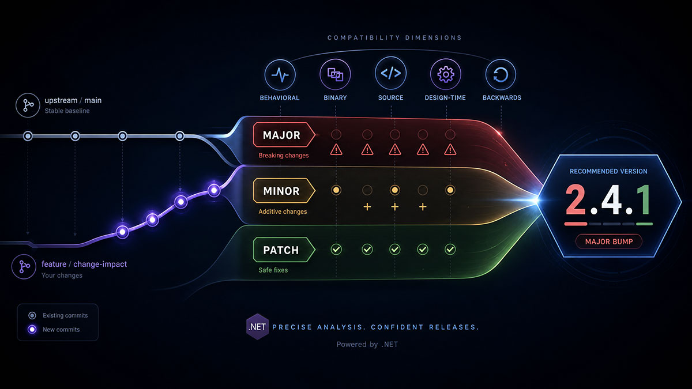

# .NET Change Impact



Classify a proposed change to a .NET library or NuGet package and recommend the correct release bump. This skill exists to stop accidental breaking releases from being shipped as a patch or minor, while staying practical enough not to label every internal refactor as breaking.

It answers one question:

> Given these changes, should I bump **Major**, **Minor**, or **Patch**?

The authority for every decision is Microsoft's official .NET compatibility guidance:

- https://learn.microsoft.com/en-us/dotnet/core/compatibility/library-change-rules
- https://learn.microsoft.com/en-us/dotnet/core/compatibility/categories

Treat those two sources as normative. When the deep category definitions or the long tail of
special cases matter, read `references/compatibility-categories.md`.

## Input

The skill accepts input in three ways, checked in this order:

**1. Explicit change details:**

When the user provides release notes, a PR summary, an API diff, a git diff, a changelog entry,
dependency update details, a bug-fix description, or a stated release intent, classify those
provided changes directly.

**2. Explicit compare range:**

When the user provides a base ref, current ref, compare URL, branch name, tag range, or commit
range, inspect that range and classify the changes found there.

**3. Default resolution (no input provided):**

When the user does not provide explicit change details or a compare range, operate on the
current Git working repository. See **Default Resolution Behavior** below.

If required information is missing and cannot be inferred or resolved, ask only for the missing
fact. Do not ask the user to restate the whole change set when the current repository or an
explicit compare range can be inspected.

## Default Resolution Behavior

If the user does not provide explicit change details, a compare URL, branch name, tag range, or
commit range, the skill must operate on the current Git working repository.

In that case, the skill must:

1. Detect the current branch.
2. Detect the upstream remote for the repository.
3. Detect the upstream repository's default branch — usually `main`, but do not assume `main` if
   the remote default branch can be resolved.
4. Compare the current branch against the upstream remote default branch.
5. Include all commits on the current branch that are not present in the upstream remote default
   branch.
6. Include the net diff for the comparison range, because compatibility impact often depends on
   files changed, signatures, project metadata, target frameworks, package references, generated
   assets, and build props/targets.
7. Classify the release bump from the collected branch changes using the normal compatibility
   rules.

The default comparison should be conceptually equivalent to:

```text
upstream/default-branch...current-branch
```

For example, if the current branch is `feature/change-impact` and the upstream default branch is
`main`, the comparison should be treated as:

```text
upstream/main...feature/change-impact
```

If the repository uses `origin` as the upstream remote, use:

```text
origin/main...current-branch
```

If the repository has both `origin` and `upstream`, prefer the remote that represents the
canonical source repository. In fork-based workflows, this is usually `upstream`. In
single-repository workflows, this is usually `origin`.

The skill must not silently assume the wrong base branch. If the default branch cannot be
resolved, fall back in this order:

1. `origin/HEAD`
2. `upstream/HEAD`
3. `origin/main`
4. `origin/master`
5. `upstream/main`
6. `upstream/master`

If none of these can be resolved, ask the user to provide the base branch or compare range.

Useful read-only commands for default resolution:

```bash
git rev-parse --abbrev-ref HEAD
git remote
git symbolic-ref refs/remotes/origin/HEAD --short
git symbolic-ref refs/remotes/upstream/HEAD --short
git merge-base HEAD {resolvedBase}
git log --oneline {resolvedBase}..HEAD
git log --format="%H%x09%an%x09%ae%x09%s%x09%b" {resolvedBase}..HEAD
git diff --name-status {resolvedBase}...HEAD
git diff --find-renames {resolvedBase}...HEAD
```

Use local Git state only for default resolution unless the user explicitly asks to refresh remote
state. Do not fetch, pull, push, or mutate repository state as part of this skill.

## Critical: include reasoning every time

Always return a structured answer with the recommendation and reasoning. Do not collapse clear
decisions to a bare one-word `Major`, `Minor`, or `Patch` response. The reasoning is part of the
value of this skill, especially for branch-level analysis where the user needs to trust why the
bump follows from the diff.

Use the template in **Output format** below for every answer. Keep the answer concise when the
decision is simple, but still explain the compatibility impact and the deciding facts.

When the answer is ambiguous, incomplete, or depends on a missing fact, still provide the best
current recommendation and make the missing fact explicit in **Deterministic decision**.

## Internal analysis process

Run this analysis internally for every request, regardless of which mode you output. Do **not**
print this checklist verbatim — it is reasoning scaffolding, not the answer format.

1. Identify all public contract changes (types, members, signatures, accessibility, contracts).
2. Identify all observable behavior changes (return values, exceptions, ordering, serialization).
3. Identify all source compatibility risks (would existing consumer code still compile?).
4. Identify all binary compatibility risks (would existing compiled consumers still load/run?).
5. Identify all design-time compatibility risks (analyzers, generators, build, tooling, restore).
6. Determine whether existing consumers remain backwards compatible end to end.
7. Determine the highest required bump across every change present.
8. Produce the structured output with recommendation, compatibility impact, reasoning, and the
   deterministic decision.

## Version bump rules

### Major — breaking or potentially breaking

Recommend `Major` when the change can break, or plausibly break, existing consumers. A change
is breaking if it can affect backwards, binary, source, or design-time compatibility, or change
observable behavior that consumers can reasonably depend on.

Changes that usually require `Major`:

- Removing a public type, member, constructor, property, method, event, field, enum value,
  attribute, or interface member.
- Renaming public APIs, or changing public method signatures.
- Changing parameter order, parameter types, return types, generic constraints, nullability
  contracts, accessibility, or inheritance behavior.
- Making a public API less accessible.
- Making previously valid consumer code fail to compile, or previously compiled consumer
  binaries fail at runtime.
- Changing observable behavior consumers can reasonably depend on: serialization, wire format,
  persisted data format, exception behavior, ordering, equality, hashing, parsing, formatting,
  validation, or default values, in a breaking way.
- Removing or reducing platform, TFM, runtime, OS, architecture, or dependency support.
- Introducing stricter validation that rejects previously accepted inputs — unless it is an
  explicitly documented bug fix that is extremely unlikely to affect valid consumers.
- Changing public abstractions or interfaces so implementers must change code.
- Changing package identity, assembly identity, strong name, namespace, or binding expectations
  in a way that affects existing consumers.

### Minor — backward-compatible additions

Recommend `Minor` when the change adds functionality without breaking source, binary,
design-time, or behavioral compatibility.

Changes that usually require `Minor`:

- Adding a new public type, method, property, constructor, overload, event, enum type, or
  extension method that does not break existing compilation or behavior.
- Adding optional, opt-in capabilities, or new behavior behind opt-in configuration.
- Adding support for a new TFM, platform, runtime, OS, architecture, or dependency version
  without removing existing support.
- Adding new package features while preserving existing contracts.
- Improving performance with no observable semantic breakage.
- Adding diagnostics, analyzers, or source generators that do not break builds by default.

Be conservative with interfaces: adding members to an existing public interface is usually
breaking for implementers and therefore usually `Major`. Default interface implementations
reduce but do not eliminate source, design-time, and behavioral risk — evaluate them, do not
wave them through.

### Patch — backward-compatible, no new public surface

Recommend `Patch` when the change preserves the public contract and adds no new public
functionality.

Changes that usually require `Patch`:

- Bug fixes that preserve the intended public contract.
- Dependency updates that do not change the public API, supported TFMs, runtime behavior, or
  compatibility guarantees.
- Security fixes that preserve compatibility.
- Internal implementation changes and refactoring with no public or behavioral impact.
- Documentation updates; build, packaging, CI, test, or housekeeping changes.
- Non-breaking performance improvements; non-breaking analyzer or warning changes.

Key nuance: a bug fix can still be breaking. If the fix changes observable behavior, exception
behavior, serialization, validation, ordering, equality, formatting, parsing, threading,
timing, or side effects that consumers may depend on, evaluate it as a potential `Major`.

## Precedence rules

When several changes ship together, choose the **highest** required bump:

```text
Major > Minor > Patch
```

- One breaking change plus several bug fixes → `Major`.
- One backward-compatible feature plus several patches → `Minor`.
- Only housekeeping and bug fixes → `Patch`.

## Conservative decision policy

When uncertain, prefer the safer classification:

- If a change might break existing consumers, recommend `Major`.
- If a change only adds backward-compatible functionality, recommend `Minor`.
- If a change only fixes or maintains existing behavior, recommend `Patch`.

But do not inflate every behavior change to `Major`. First decide whether the behavior is
actually observable, documented, reasonably relied upon, or compatibility-sensitive. An
internal or non-observable change is not a breaking change just because something changed.

## Compatibility classification

When you produce an explanation, classify the impact using these five categories. Full,
Microsoft-grounded definitions and examples live in `references/compatibility-categories.md`;
the summary here is enough for most decisions.

- **Behavioral change** — the API still compiles and loads, but observable behavior differs
  (return values, exceptions, validation, ordering, equality/hash, serialization, formatting,
  side effects, threading/timing/caching). Can be breaking even when binary and source
  compatibility are intact.
- **Binary compatibility** — existing compiled assemblies may fail against the new version
  without recompilation (removed members, changed signatures, changed assembly identity,
  changed type shape). Usually implies `Major`.
- **Source compatibility** — existing source must change to compile (renames, signature
  changes, removals, new constraints, ambiguous overloads, changed accessibility/nullability,
  required language/TFM bumps). Usually implies `Major`.
- **Design-time compatibility** — build, tooling, analyzers, generators, project system, IDE,
  or restore behavior changes (new default-on analyzer errors, changed generator output,
  build/props/targets changes, SDK/tooling requirements). May imply `Major` if it breaks
  existing consumers by default.
- **Backwards compatibility** — the end-to-end test: can existing consumers of the old version
  use the new version unmodified, with equivalent behavior? If they cannot compile, run, or
  build, or they observe a breaking behavior change, it is not backwards compatible and usually
  requires `Major`.

## Special cases

These recur often enough to call out directly. The full catalog is in
`references/compatibility-categories.md`.

- **Dependency updates** — default `Patch`. Escalate to `Minor` or `Major` only if the update
  changes public API exposure, supported TFMs/platforms, runtime behavior, introduces
  binding/runtime incompatibility, requires consumers to update their own dependencies, or
  drops compatibility with existing consumers.
- **Bug fixes** — default `Patch`. If the old, incorrect behavior was publicly observable and
  consumers may depend on it, explain the trade-off; it may still need `Major`.
- **New overloads** — usually `Minor`, but check for overload-resolution ambiguity. If existing
  source could bind differently or fail to compile, consider `Major`.
- **Interface changes** — adding members to a public interface is usually `Major` (implementers
  may fail to compile). Adding a brand-new interface is usually `Minor`. Default interface
  members still warrant caution and explanation.
- **Enum changes** — adding values is usually `Minor`, but may be behavioral or source-impacting
  if consumers exhaustively switch over values or serialization contracts are affected. Removing
  or renaming values is usually `Major`.
- **Analyzer / source generator / build changes** — warnings-only diagnostics that do not break
  default builds are usually `Patch` or `Minor` by scope. Diagnostics that become errors by
  default, or generated-code changes that break consumers, are usually `Major`.
- **TFM / platform support** — adding support is usually `Minor`; removing support is usually
  `Major`. Raising the minimum supported runtime, SDK, language version, OS, or CPU architecture
  is usually `Major` when existing consumers are affected.
- **Performance changes** — usually `Patch` when behavior is unchanged; may be `Major` when
  timing, ordering, threading, concurrency, caching, resource lifetime, or side effects are
  observable and compatibility-sensitive.

## SemVer and .NET version-number mapping

### Semantic Versioning — `MAJOR.MINOR.PATCH`

- `Major` → increment Major, reset Minor and Patch to `0`.
- `Minor` → increment Minor, reset Patch to `0`.
- `Patch` → increment Patch.

### .NET assembly/file versioning — `Major.Minor.Build.Revision`

- `Major` → increment Major. Reset or align Minor per project policy.
- `Minor` → increment Minor.
- `Patch` → normally maps to Build or Revision per project policy.
- `Build` and `Revision` are CI/build metadata. Never use them to hide a breaking change, and
  do not use them as a substitute for a SemVer Patch when NuGet package versioning is involved.

## Input interpretation

Input may arrive as release notes, git commits, PR summaries, API diffs, changelog entries, dependency updates, bug-fix descriptions, a stated release intent, or the default current-branch comparison. Distinguish carefully between: public API changes, internal implementation changes, consumer-visible behavior changes, build/design-time changes, documentation-only changes, package/dependency changes, and platform/TFM support changes. The bump follows the most impactful real change, not the loudest commit subject.

## Output format

Use exactly this structure:

```markdown
## Recommendation

<Major|Minor|Patch>

## Key changes identified

<Short bullet list of the branch changes or provided changes that drive the bump. Omit only when
there is truly no concrete change to list.>

## Compatibility impact

- Behavioral change: <yes/no/possible> — <reason>
- Binary compatibility: <yes/no/possible> — <reason>
- Source compatibility: <yes/no/possible> — <reason>
- Design-time compatibility: <yes/no/possible> — <reason>
- Backwards compatibility: <yes/no/possible> — <reason>

## Reasoning

<Why this bump is recommended. Reference the official .NET compatibility principles,
especially whether existing consumers can compile, run, and observe equivalent behavior.>

## Deterministic decision

<If clear: the decisive fact that makes the recommendation unambiguous. If ambiguous: the single
missing fact that would make the answer deterministic, for example, "Is `Parse` part of the public
API or internal?">
```

## Good output characteristics

- Always includes reasoning, even for clear `Major`, `Minor`, or `Patch` recommendations.
- Puts the recommendation first so the answer is still easy to scan.
- Names the key changes found in the branch or input before interpreting them.
- Picks the highest required bump when changes are mixed.
- Grounds every breaking-change call in whether existing consumers can compile, run, and
  observe equivalent behavior.
- Stays conservative on interface and behavioral risk without inflating internal-only changes.

## Bad output characteristics

- Collapsing a clear change into a bare one-word answer without explaining why.
- Collapsing an ambiguous or mixed change into a recommendation that hides a compatibility risk.
- Labeling a publicly observable behavior change as `Patch` just because it is "a fix".
- Calling an internal, non-observable refactor `Major`.
- Hiding a breaking change behind a Build/Revision bump.
- Inventing compatibility guarantees or migration steps the input does not support.
