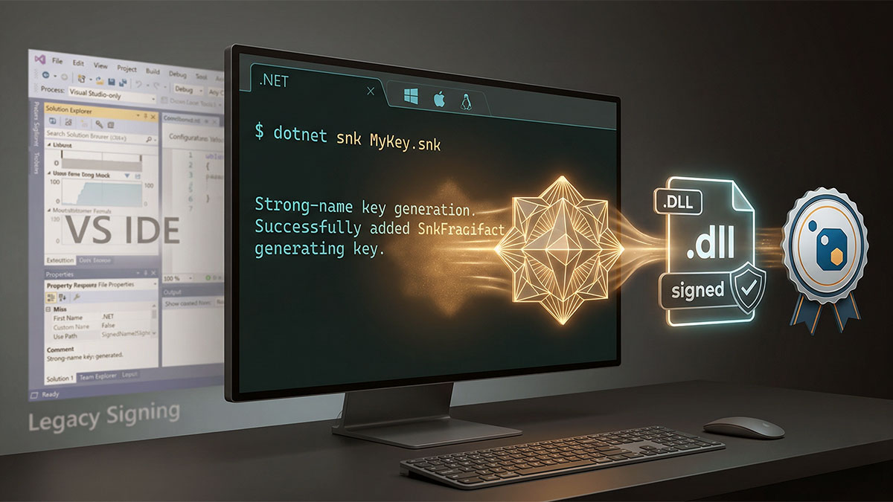

# Strong Name Signing for .NET



Generate a strong name key pair (`.snk` file) for signing .NET assemblies. Uses the .NET runtime's built-in `RSACryptoServiceProvider` instead of `sn.exe`, so it works in any terminal and, when local PowerShell syntax is preferred, runs through **`pwsh` 7+** — no Visual Studio Developer Command Prompt needed.

## Why this matters

The traditional approach requires `sn.exe -k MyKey.snk`, which is only available in the Visual Studio Developer PowerShell. This is a common pain point — developers outside Visual Studio (using VS Code, Rider, or plain terminals) can't easily generate key files. The pure .NET approach eliminates this dependency entirely.

Strong names in .NET are about **identity, not security** ([Microsoft's guidance](https://github.com/dotnet/runtime/blob/main/docs/project/strong-name-signing.md)). They ensure assembly uniqueness and are recommended for all publicly published NuGet packages because of strong-naming's viral nature — an unsigned library can't be consumed by signed applications.

## Workflow

### Step 1: Collect Parameters

Read `FORMS.md`, compute the defaults silently, and present a single summary for confirmation. Only ask follow-up questions for individual fields if the user wants to override a computed or default value. Do not proceed to Step 2 until the user confirms the summary.

### Step 2: Generate the Key File

Run this command block in a `pwsh` 7+ session in the target directory:

```ps1
$rsa = New-Object System.Security.Cryptography.RSACryptoServiceProvider({KEY_SIZE})
$keyBlob = $rsa.ExportCspBlob($true)
[System.IO.File]::WriteAllBytes("{OUTPUT_PATH}", $keyBlob)
$rsa.Dispose()
```

Where:
- `{KEY_SIZE}` — RSA key size from parameters (default: 1024)
- `{OUTPUT_PATH}` — full path combining `{OUTPUT_DIR}` and `{KEY_NAME}.snk`

The `ExportCspBlob($true)` method exports the full key pair (public + private) in the exact CSP blob format that `sn.exe -k` produces. The `$true` parameter includes the private key — essential for signing during builds.

### Step 3: Verify and Report

After generating the file, verify it exists and report:

```ps1
$snkFile = Get-Item "{OUTPUT_PATH}"
Write-Host "✅ Strong name key generated"
Write-Host ""
Write-Host "  File:     $($snkFile.Name)"
Write-Host "  Size:     $($snkFile.Length) bytes"
Write-Host "  Location: $($snkFile.FullName)"
Write-Host "  Key size: {KEY_SIZE}-bit RSA"
```

Then provide usage guidance based on what was generated:

```
  Usage in .csproj:
    <PropertyGroup>
      <SignAssembly>true</SignAssembly>
      <AssemblyOriginatorKeyFile>path\to\{KEY_NAME}.snk</AssemblyOriginatorKeyFile>
    </PropertyGroup>

  Or via Directory.Build.props for solution-wide signing.
```

### Step 4: Security Reminder

Remind the user about `.snk` file handling:

- **Open source projects:** Microsoft recommends checking in the `.snk` file — strong names are for identity, not security. This lets contributors build drop-in replacements.
- **Closed source / proprietary:** Keep the `.snk` file out of source control. Add `*.snk` to `.gitignore` and distribute through secure channels (CI/CD secrets, key vaults).
- **Public signing alternative:** For open source projects that want signing without distributing the private key, consider [public signing](https://github.com/dotnet/runtime/blob/main/docs/project/public-signing.md) with `<PublicSign>true</PublicSign>`.

## Technical Notes

### Why RSACryptoServiceProvider over RSA.Create()?

`RSACryptoServiceProvider.ExportCspBlob()` produces the exact CSP (Cryptographic Service Provider) blob format that MSBuild's `SignAssembly` task expects. While `RSA.Create()` is the modern API, its `ExportRSAPrivateKey()` outputs PKCS#1 DER — a different format that would require conversion. The CSP approach is a direct drop-in replacement for `sn.exe` output.

### Key Size

- **1024-bit** (default): Matches `sn.exe -k` default. Strong names are about identity, not security — this is sufficient for the vast majority of projects.
- **2048-bit**: Larger key, no practical benefit for strong naming but available if desired.
- **4096-bit**: Largest key. Only needed if organizational policy requires it.

### Cross-Platform

This approach works on Windows, macOS, and Linux — anywhere the .NET runtime or `pwsh` 7+ is installed. The `RSACryptoServiceProvider` class is available in both .NET Framework and .NET (Core).
