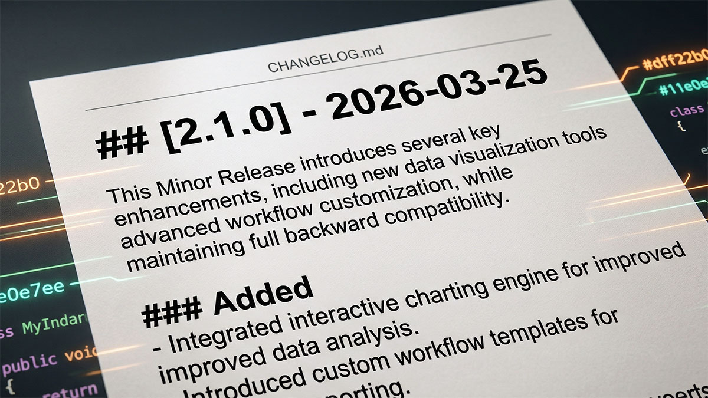

# Git Keep A Changelog



This skill creates or updates `CHANGELOG.md` directly using the Keep a Changelog 1.1.0 structure. It is git-aware, changelog-focused, and optimized for a human-readable release summary rather than generated release-note noise.

Read `FORMS.md` when pending worktree changes require user confirmation and the host supports native structured input controls. If native structured input is unavailable, use the deterministic plain-text fallback defined there. `FORMS.md` is not used in yolo/auto mode — see **Yolo / Auto Mode** below.

## Yolo / Auto Mode

Only after this skill has been selected by explicit changelog or release-note intent, `yolo` or `auto` in that same request (case-insensitive) enables full-autonomy mode. Bare `yolo` / `auto`, `git bot commit yolo`, and other commit-execution requests do not activate this skill:

- **Skip Step 3 entirely.** Do not ask the confirmation question. Do not present the `Yes / No / Custom` gate.
- **Include all pending changes automatically.** Staged, unstaged, and untracked files are all treated as part of the release scope without asking.
- **Keep committed history isolated.** Yolo changes only the pending-worktree decision; use the same resolved branch ranges and bleed guard as every other invocation.
- **Make all scope decisions independently.** The user has explicitly delegated judgment. Do not pause for input at any point in the workflow.
- All other quality rules remain in force: the release highlight is still required, the SemVer classification is still required, bullet punctuation still applies, and the compare-link footer must still be maintained.
- Yolo/auto is a user signal of full autonomy — not a shortcut past quality. Treat it as deliberate and act on it immediately.

## Non-Negotiable Rules

- Create or update `CHANGELOG.md` directly, then stop for user review.
- If `CHANGELOG.md` does not exist, create a compliant one before populating it.
- Read full commit subjects and bodies before writing the changelog.
- Inspect the net diff too; do not infer the release from subjects alone.
- Classify each user-facing release entity from whether it existed at the resolved base before considering intermediate commits or individual files.
- Treat branch or range topology as the changelog scope source of truth, not author identity.
- For branch-derived scope, exclude every commit already reachable from the comparison branch. A merge-base is a boundary, not a release commit.
- Run `scripts/resolve-release-scope.ps1` for branch-derived scope and use its emitted ranges without widening them.
- For every path-backed release entity, run `scripts/resolve-release-entity.ps1` with the emitted `merge_base` and `head_commit`; use its classification instead of inferring `Added`, `Removed`, or `Changed` from commit verbs.
- Never change range inclusivity because the changelog target is a concrete version instead of `[Unreleased]`.
- Include commits from every author/contributor in the selected scope. Do not filter to the current git user, current contributor, bot identity, configured author, or "my changes" unless the user explicitly asks for an author-filtered changelog.
- If the current branch starts with a version hint such as `v0.3.0/`, use that to target a concrete release heading.
- If a concrete target heading already exists but its matching `vX.Y.Z` tag does not, treat that heading as an unreleased draft and regenerate it from the resolved git result instead of preserving stale bullets as a second baseline.
- Otherwise, target `## [Unreleased]`.
- Always write a release highlight immediately below the target heading.
- The release highlight must explicitly classify the release as `major`, `minor`, or `patch`.
- Use the standard Keep a Changelog section order: `Added`, `Changed`, `Deprecated`, `Removed`, `Fixed`, `Security`.
- Omit empty sections instead of emitting placeholders.
- Always maintain the Keep a Changelog compare-link footer at the bottom of the file.
- Preserve natural line breaks and readable prose. Do not apply any fixed column limit or artificial hard wrapping to changelog paragraphs or bullets.
- End each bullet with `,` and end the last bullet in each section with `.`.
- If pending worktree changes exist for a concrete release draft, do not silently include or exclude them. Ask the user first with a short `Yes / No / Custom` prompt. **Exception: in yolo/auto mode, include all pending changes automatically without asking.**
- Yolo/auto changes pending-worktree handling only. It never widens committed history or includes the comparison boundary.
- Do not dump commit subjects verbatim into the changelog.
- Do not treat the current contents of the target heading as a release-classification baseline; git state is the baseline.
- Do not invent unsupported changes, risks, or migration guidance.

## Mandatory Checkpoints

These checkpoints cannot be skipped or bypassed, even when the user's opening request sounds like a shortcut.

1. Step 3 confirmation gate: if pending worktree changes exist for a concrete release such as `## [1.2.3]`, present the confirmation question before drafting or writing the changelog entry. **Bypassed in yolo/auto mode — all pending changes are included automatically.**
2. Release isolation: for branch-derived scope, run the bundled resolver and require `base_history_bleed` to be `false`. The `excluded_boundary_commit` must not appear in `selected_commits`.
3. Release highlight contract: every concrete release entry must include a release highlight paragraph that explicitly classifies the release as `major`, `minor`, or `patch`.
4. Bullet punctuation: all bullets must end with `,` except the final bullet in each populated section, which must end with `.` Do not finish the edit until this is consistent.

## Deterministic Reduction Model

When the comparison scope is resolved, use this model:

```text
Result = semantic_delta(Base, HEAD [+ approved pending changes])
History = provenance used to explain Result
```

History is evidence; the resulting state is truth.

The current contents of the target heading are cached output, not a release baseline. When rerunning on an unreleased version branch whose matching tag is absent, discard the prior draft narrative and regenerate the heading from the resolved base-to-`HEAD` result so later refinements to the same new capability remain part of its `Added` outcome.

Reduce first. Interpret second. Summarize last.

Establish the classification baseline at the user-facing release-entity boundary, not independently for every changed file. For a repo-managed skill, the entity is the skill capability together with its dedicated files and inseparable registration, catalog, documentation, validation, and eval wiring. If that entity is absent at the base and present at `HEAD`, its introduction is `Added`; intermediate commits that refine, fix, document, or validate it cannot create `Changed` or `Fixed` outcomes for that same new entity. A change to a separately pre-existing shared capability remains its own outcome and is classified from its own base state.

1. Inspect cumulative manifest and version deltas across `diff_range`.
2. Inspect the cumulative base-to-`HEAD` diff.
3. Inspect any approved pending worktree changes that are part of the draft.
4. Determine which changes actually survive at the final state.
5. Read chronological commit subjects and bodies as supporting context.
6. Use history to explain the surviving outcomes, then map them into Keep a Changelog sections.

Do not summarize commits one by one and deduplicate the prose afterward. Classify only surviving release outcomes.

Reconciliation rules:

- Base absent and `HEAD` absent -> omit it.
- Release entity absent at base and present at `HEAD` -> one surviving `Added` outcome in its final form. Do not emit `Changed` or `Fixed` outcomes for refinements within that same introduction cycle.
- Base present and `HEAD` absent -> one surviving `Removed` outcome.
- Base present and identical `HEAD` state -> omit it.
- Base present and changed `HEAD` state -> one surviving modification whose section is derived from the final delta.
- Equivalent entity at path A in base and path B in `HEAD` -> treat it as a rename or move when the cumulative diff supports that, not `Added` plus `Removed`.

Examples:

- Dependency `1.0 -> 2.0 -> 1.0` -> no changelog entry.
- Feature added, fixed three times, then removed -> no changelog entry.
- Existing behavior changed and then reverted exactly -> no changelog entry.
- File deleted and recreated identically -> no changelog entry.
- One capability added, revised, and still present -> usually one `Added` bullet describing its final form, not separate `Added`, `Changed`, and `Fixed` bullets.
- New `skills/dotnet-test/` capability added, then documented, validated, and refined before release -> `Added` only for the complete shipped capability. README registration and validator/eval wiring whose sole purpose is that introduction stay part of the added outcome.
- Existing `## [0.9.0]` draft with one `Added` bullet, then more commits refine the same unreleased `dotnet-test` capability -> rewrite the draft so `dotnet-test` stays under `Added`; do not append `Changed` or `Fixed` just because the earlier draft already exists.

## Release Highlight Contract

Every updated changelog entry must begin with a short human-written highlight paragraph directly below the heading.

That highlight must:

- act as the TL;DR for the release
- explicitly say whether this is a `major`, `minor`, or `patch` release
- summarize the net effect of the populated sections
- reflect the full commit bodies and net diff, not just the subjects

Example shape:

```md
## [0.3.0] - 2026-03-16

This is a minor release focused on grouped git visual summaries,
validator hardening, and clearer changelog automation guidance.

### Added
...
```

When the history clearly carries migration risk or upgrade caveats, add an advisory block such as:

```md
> [!WARNING]
> Upgrading to this release requires ...
```

Only add callouts when the commits or diff justify them.

## User Intent vs. Mandatory Gates

### User intent can refine scope after the gate

Explicit instructions such as `staged only`, `include unstaged changes`, or `exclude untracked` can refine the changelog scope after the Step 3 confirmation gate has been presented and answered.

### User intent cannot bypass the gate

- Do not skip Step 3 just because the user says `include everything`, `all changes`, `commit manually`, or `don't ask`.
- Do not omit the release highlight paragraph for a concrete release.
- Do not omit the explicit `major`, `minor`, or `patch` classification.

The Step 3 confirmation gate exists to prevent silent inclusion of worktree changes in a permanent release entry. It is a required safety checkpoint, not optional friction.

**Exception — scoped yolo/auto bypasses the gate by design.** When the user explicitly passes `yolo` or `auto` within an explicit changelog or release-note request, they are granting full autonomy for that changelog task. That is not a vague hint like `include everything` — it is a deliberate, recognized mode. Skip Step 3, include all pending changes, and proceed.

### Why this matters

Silent inclusion of pending changes in a changelog is a production risk. The gate ensures the release scope is intentional, visible, and explicitly confirmed before the draft becomes part of the project's recorded release history.

## Workflow

### Step 1: Resolve the source range

Use the most explicit scope the user gave you.

- If the user named a complete range, use that exact range. Do not silently add `^`, move its boundary, or reinterpret inclusivity.
- If the user named a base branch or PR target, pass it as `-BaseRef` to the bundled resolver.
- Otherwise, run the resolver without `-BaseRef`. It derives the remote's default branch from the current branch's tracking remote, then falls back to `origin/main`, `origin/master`, `main`, or `master` only when those refs exist locally.
- Never use the current feature branch's same-name tracking ref as its comparison base. For example, `origin/v1.2.3/service-update` tracks delivery of the feature branch; it is not the branch the PR changes are measured against.
- Do not fetch, pull, or contact a remote while resolving scope. Use local refs. If the correct PR target is not available locally, stop and ask for the base branch instead of guessing.

Never add `--author`, `--committer`, current-user, current-email, current-contributor, or identity-mode filters while resolving ordinary branch-level changelog scopes. Author metadata may help explain ownership, but it must not narrow the default release scope.
Do not stop to ask whether the latest branch commit, release-prep commit, or another contributor's commit "should count". If it is on the selected branch or range, it is in scope by default unless the user explicitly narrows the author or range.

For a branch-derived scope, run:

```powershell
pwsh -NoProfile -File <skill-root>/scripts/resolve-release-scope.ps1 -Repository .

# When the user named the PR target or base branch:
pwsh -NoProfile -File <skill-root>/scripts/resolve-release-scope.ps1 -Repository . -BaseRef origin/release/1.x
```

The JSON output separates two evidence surfaces:

- `history_range` is the commit-SHA-pinned equivalent of `<comparison-ref>..HEAD`. Use it for commit logs because it selects commits unique to the checked-out branch and excludes everything already reachable from the comparison branch.
- `diff_range` is the commit-SHA-pinned equivalent of `<merge-base>..HEAD`. Use it for manifest and net diffs because it measures the branch's resulting file changes from the common boundary without treating later base-only work as removals.

The comparison boundary is always excluded from a branch-derived release, even when it is tagged or the changelog target is a concrete version. If the previous release tag points at the merge-base, that confirms the commit belongs to the previous release; it is not a reason to include it.

Do not confuse the excluded merge boundary with the first PR commit. `history_range` includes every branch-unique commit after that boundary, including the PR's earliest commit and commits from other contributors. This preserves complete checked-out PR coverage without importing completed base-branch history.

### Step 2: Resolve the changelog target

Determine whether to write a concrete release section or update `[Unreleased]`.

When the user asks to "finalize", "ready to release", "rtr", "release", "publish", or "ship" (or similar release-intent words):
- Extract the version from the current branch name if it starts with a version prefix such as `v0.3.0/feature-name`.
- When the target is `## [X.Y.Z]`, check whether `refs/tags/vX.Y.Z` exists locally. If it does not, any existing `## [X.Y.Z]` section is still a branch draft rather than released history.
- Target `## [X.Y.Z] - YYYY-MM-DD` (today's date) for that extracted version.
- This is a strong signal that the user wants to finalize that specific release in the changelog.

Otherwise:
- If the branch name starts with a version prefix such as `v0.3.0/feature-name`, target `## [0.3.0] - YYYY-MM-DD`.
- Strip the leading `v` from the visible changelog heading, but keep tag comparisons in `vX.Y.Z` form.
- If no version hint exists, target `## [Unreleased]`.
- If the target heading already exists, update it in place instead of duplicating it.
- For an existing concrete heading whose matching tag is absent, replace the release highlight and populated sections wholesale from the current resolved git evidence. Do not preserve an older `Added` bullet and then layer later pre-release refinements into `Changed` or `Fixed`.

### Step 3: Confirm Pending Worktree Changes (MANDATORY GATE)

This is a required checkpoint. Do not proceed to Step 4 until this step is complete.

After resolving the target heading, check whether the worktree contains changes that are not part of the committed history yet.

**If yolo/auto mode is active: skip this entire step.** Include all pending changes (staged, unstaged, untracked) automatically and proceed to Step 4.

- Count staged, unstaged, and untracked changes separately.
- If there are no pending changes, continue normally.
- If there are pending changes and the target is a concrete release heading such as `## [1.2.3]`, you must ask a direct confirmation question before drafting the changelog entry.
- User intent hints such as `all changes`, `include everything`, `commit manually`, or `don't ask` do not bypass this gate.
- When the host supports native structured input controls, use `FORMS.md` for this confirmation flow, but keep the prompt text and `Yes / No / Custom` meaning identical to the plain-text path.
- Present this question:

```text
I found pending changes not yet committed for release 1.2.3: 4 staged, 2 unstaged, 1 untracked. Include them in the changelog draft? Yes / No / Custom
```

- Do not skip this question.
- Keep the prompt short and concrete. Do not drift into commit-range jargon or enumerate scope rules unless the user chooses `Custom` or asks for detail.
- `Yes` means include the pending changes in addition to the committed range.
- `No` means use committed history only.
- `Custom` means let the user narrow the scope, for example `staged only` or `exclude untracked`.
- Keep the widget-backed path and the plain-text fallback semantically identical: same `Yes / No / Custom` order, same meaning, and the same follow-up scope question only when `Custom` is chosen.
- Wait for the user's explicit response before proceeding to Step 4.
- For `## [Unreleased]`, use the same short prompt when pending worktree changes are relevant to the user's request. Do not silently fold them into the draft unless the user explicitly asked for current worktree coverage.

Helpful commands:

```bash
git status --short --branch
git diff --cached --stat
git diff --stat
git ls-files --others --exclude-standard
```

### Step 3b: Verify Release Isolation

For branch-derived scope, inspect the resolver output before reading history or diffs:

1. Require `base_history_bleed` to be `false`.
2. Confirm `excluded_boundary_commit` is absent from `selected_commits`.
3. Confirm `comparison_ref` is the intended PR target or default branch, not the current feature branch's tracking ref.
4. Record `history_range` and `diff_range` exactly as emitted. Do not append `^` or widen either range for a concrete release.

If any check fails, stop without editing `CHANGELOG.md`. Report the resolved refs and ask for the correct base branch. This is a correctness failure, not a reason to guess another range.

### Step 4: Read the cumulative result before the chronology

Follow these sub-steps in order. Manifest detection and cumulative manifest diffs must run before commit-body interpretation.

**4a — Detect manifest changes.** Check the files changed across the emitted `diff_range`:

```bash
git diff --name-only <diff_range>
```

If any dependency or version manifest appears — `Directory.Packages.props`, `Directory.Build.props`, `package.json`, `pnpm-lock.yaml`, `yarn.lock`, `pom.xml`, `build.gradle`, `go.mod`, `go.sum`, or similar — proceed to 4b immediately. Do not read commit bodies first.

**4b — Diff each touched manifest.** For every manifest found in 4a, run its cumulative diff across the emitted `diff_range`:

```bash
git diff <diff_range> -- Directory.Packages.props
git diff <diff_range> -- package.json
# Repeat for every manifest identified in 4a.
```

Parse the cumulative delta: which packages were added, removed, upgraded, or downgraded, and the exact before → after versions that survive at `HEAD`. This is the authoritative dependency evidence. Individual commit messages may describe partial steps; they do not override the resulting manifest diff.

**4c — Inspect the cumulative diff before history.** Use the emitted `diff_range`:

```bash
git diff --name-status -M -C <diff_range>
git diff --stat <diff_range>
git diff <diff_range>
```

Resolve the cumulative file, config, dependency, and behavior deltas from base to `HEAD`. Do not derive the changelog by accumulating labels from individual commits.

**4d — Inspect approved pending changes when they are in scope.** When the user approved pending changes in Step 3, also inspect the selected worktree deltas. In yolo/auto mode, inspect all of them automatically:

```bash
git diff --cached
git diff
git ls-files --others --exclude-standard
```

Pending changes are additive final-state evidence. They never justify widening `history_range` or `diff_range`.

**4e — Determine the surviving outcomes at the final state.**

- Identify each user-facing release entity and test its existence at the resolved base before classifying its child paths or commit verbs.
- For each path-backed entity, run the bundled classifier. Pass `-IncludeWorktree` only when pending changes for that entity are in the approved scope:

```powershell
pwsh -NoProfile -File <skill-root>/scripts/resolve-release-entity.ps1 -Repository . -BaseCommit <merge_base> -HeadCommit <head_commit> -EntityPath skills/dotnet-test
```

- Treat the emitted `classification` as authoritative for `Added`, `Removed`, `Changed`, or `Unchanged`. Use semantic analysis only to group paths into the correct user-facing entity and to choose among non-structural sections such as `Fixed` or `Security` when the entity already existed at the base.
- Eliminate exact reversions, temporary files/features, and dependency churn that returned to the base value.
- Merge intermediate add/change/fix churn into the final surviving capability or behavior.
- Preserve rename/move as one surviving outcome when the cumulative diff supports it.
- Do not place one surviving outcome under multiple changelog sections merely because its lifecycle crossed several verbs during development.

**4f — Read the full branch-unique commit log.** Use the emitted `history_range`:

```bash
git log --reverse --format=medium <history_range>
git log --reverse --stat --format=medium <history_range>
```

Read every selected contributor's full subject and body. The boundary commit and any commit already reachable from the comparison branch are absent by construction and must remain absent.

Use history only to explain the surviving outcomes, confirm rename intent, extract accurate user-facing terminology, and understand why a fix matters. Never let an intermediate commit override contradictory final-state evidence.

### Step 5: Classify the release

Infer the SemVer class from the surviving change set.

- `major` when the release includes breaking removals, required migration, incompatible contract changes, or other true breaking behavior.
- `minor` when the release adds meaningful new capabilities without breaking existing consumers.
- `patch` when the release is primarily fixes, service updates, docs, validation, maintenance, dependency work, or other non-breaking refinement.

Do not over-classify from dramatic wording in a commit subject. The surviving delta matters more than the phrasing of one commit.

### Step 6: Curate the changelog content

Write the release highlight first, then the populated sections.

- Map only the surviving outcomes into `Added`, `Changed`, `Deprecated`, `Removed`, `Fixed`, and `Security`.
- Keep bullets curated and human-written.
- Merge overlapping commits into one bullet when they describe the same real outcome.
- A capability absent at the base and present at the final state appears under `Added`, even when later commits fixed, documented, validated, or refined it before release.
- Supporting catalog, documentation, validator, and eval changes whose sole purpose is introducing that new capability stay with its `Added` outcome. Classify a shared-file change separately only when it changes a pre-existing capability independently of the new introduction.
- A capability, file, or dependency change that returned to the base state stays out of the changelog entirely.
- Drop low-signal churn such as typo-only commits, trivial fixups, or mechanical follow-ups unless they materially change the release story.
- Use history only for naming, rationale, rename intent, and bug context. Do not let a dramatic commit message manufacture an extra bullet that the final diff does not support.
- Use natural prose line breaks. Keep paragraphs and bullets readable, but do not column-wrap them artificially or target a fixed line width.
- End each bullet with `,` except the final bullet in a populated section, which must end with `.`.

### Step 7: Update CHANGELOG.md carefully

Preserve the file's existing structure while editing.

- If `CHANGELOG.md` is missing, create it with the standard title, intro paragraph, `## [Unreleased]`, and compare-link footer before inserting release content.
- Keep the introduction and existing release history intact.
- If writing a concrete release section, insert it below `## [Unreleased]` and above older releases.
- If writing to `## [Unreleased]`, keep the heading and update only its content.
- When updating an existing target heading, rebuild the release highlight and populated sections from the newly resolved surviving outcomes. Delete or rewrite stale bullets that no longer reflect the final release story instead of incrementally patching around them.
- On every edit, verify that the compare-link footer exists at the bottom of the file. If it is missing or incomplete, insert or repair it instead of leaving the changelog without diff ranges.
- When adding or updating a concrete version, `[Unreleased]` should compare from the newest released version to `HEAD`, and that released version should compare from the previous version tag to the new tag.
- Preserve valid historical compare links for older releases. Repair only the links that are missing, incomplete, or wrong.
- Do not remove existing links or historical entries unless they are demonstrably wrong.

### Step 8: Stop after the edit

After updating `CHANGELOG.md`, stop and let the user review the file. Do not commit, tag, push, or create a release unless the user asks.

## Good Output Characteristics

- Reads like a curated release narrative, not a generated log dump.
- Uses the Keep a Changelog section order consistently.
- Includes a required SemVer-aware release highlight.
- Creates a compliant `CHANGELOG.md` scaffold when the file is missing.
- Reflects the meaning of full commit bodies and the net diff.
- Classifies only surviving base-to-`HEAD` outcomes; reverted or cancelled work disappears.
- Resolves branch-derived scope with the bundled script, uses branch-unique commits for history and the merge boundary for net diffs, and verifies that no selected commit is already reachable from the comparison branch.
- Excludes the comparison boundary from both concrete releases and `[Unreleased]`; changelog heading choice never changes Git range inclusivity.
- Treats the selected branch or range as author-agnostic scope and includes every contributor's commits unless the user explicitly narrows by author.
- Treats Step 3 as a mandatory confirmation gate for concrete releases and asks the `Yes / No / Custom` question before including pending worktree changes (or skips Step 3 entirely and includes all changes when yolo/auto mode is active).
- Keeps yolo/auto limited to pending-worktree inclusion and never uses autonomy mode to widen committed history.
- If an unreleased concrete version draft already exists, rewrites that draft from the current git truth so pre-release refinements to a base-absent capability remain under `Added`.
- Maintains or inserts the compare-link footer at the bottom of the file on both create and update paths.
- Preserves natural prose wrapping with no fixed column-width target.
- Keeps bullets specific, concrete, non-repetitive, and consistently punctuated.
- Preserves existing compare-link structure when updating versions.

## Bad Output Characteristics

- **CRITICAL — Including the comparison boundary or previous release commit in a new release.** This silently duplicates already-released work. Never widen a branch-derived range with `^`; require the resolver's bleed guard to pass before writing.
- Copying commit subjects line by line into the changelog.
- Reporting temporary features, files, APIs, or dependencies that leave no surviving base-to-`HEAD` change.
- Putting one surviving capability under multiple sections because its intermediate commits used different verbs.
- Putting any part of a base-absent capability under `Changed` or `Fixed` because later commits refined, documented, validated, or fixed it before its first release.
- Using an older unreleased draft heading as a second baseline, preserving its earlier `Added` bullet and then appending `Changed` / `Fixed` for later commits to the same still-unreleased capability.
- Omitting the release highlight.
- Failing to classify the release as major, minor, or patch.
- Refusing to proceed just because `CHANGELOG.md` does not exist yet.
- Silently including, silently ignoring, or otherwise bypassing the pending-worktree confirmation gate for a concrete release draft (bypassing via explicit `yolo` or `auto` is intentional, not silent).
- Using any artificial fixed-width wrapping for changelog prose.
- Mixing bullet punctuation or leaving section bullets without the required trailing `,` / final `.` pattern.
- Emitting empty `Added` / `Changed` / `Fixed` headings.
- Updating an existing changelog entry but leaving the compare-link footer missing or stale.
- Claiming breaking changes, fixes, or security work not supported by git.
- Filtering the selected branch or range to the current user's or current contributor's commits, or treating "my changes" as the default release scope.
- Using the feature branch's same-name remote tracking ref as the comparison base, producing an empty or misleading branch scope.
- Letting a concrete version heading or yolo/auto mode change committed-history inclusivity.
- Summarizing commit chronology first and trying to deduplicate the prose afterward instead of reducing the final state first.
- Understating dependency or version changes because the skill only read individual commit diffs and never inspected the surviving manifest delta from base to `HEAD`.
- Reading commit messages before running manifest diffs, then reporting only the packages mentioned in whichever commits happened to be read first, rather than the full cumulative set from the manifest diff.
