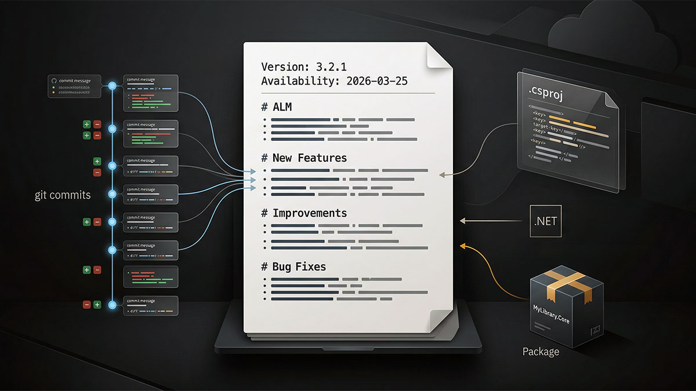

# Git NuGet Release Notes



This skill creates or updates cumulative `.nuget/{ProjectName}/PackageReleaseNotes.txt` files for packable .NET projects by reading git history and the actual project/package metadata. It is intentionally closer to the package-note style used in codebelt repositories than to a repo-wide `CHANGELOG.md`.

Read `references/package-release-notes-format.md` before writing any release-note block.

## Critical

- Create or update `.nuget/{ProjectName}/PackageReleaseNotes.txt` directly, then stop for user review.
- Discover packable projects under `src/`; ignore `test/`, `tuning/`, `tooling/`, and projects that are explicitly non-packable.
- Prefer an existing `.nuget/{ProjectName}/` folder when one already exists for the packable project. If none exists, create `.nuget/<MSBuildProjectName>/PackageReleaseNotes.txt`.
- For repo-wide requests, every packable `src/` project should end up represented by a corresponding `PackageReleaseNotes.txt` file.
- Treat the package's base-to-`HEAD` state as truth; chronological history is supporting provenance.
- Inspect cumulative package, API, manifest, version, and metadata deltas before classifying the package history.
- Classify each user-facing package capability from whether it existed at the resolved base before considering intermediate commits or individual files.
- Describe only surviving package outcomes. Do not preserve intermediate upgrades, removals, renames, or bug fixes that do not survive into `HEAD`.
- Read full commit subjects and bodies before writing the package notes.
- Inspect the net diff too; do not classify a package from commit subjects alone.
- Use cumulative newest-first history.
- If the target version already exists at the top of the file, rewrite that block in place instead of duplicating it.
- If the target version is not present, prepend the new block above the older history.
- Normalize the block you write to `Version:` and `Availability:`.
- Always include `# ALM` in the block you write.
- Use only this section order when sections are populated: `ALM`, `Breaking Changes`, `New Features`, `Improvements`, `Bug Fixes`, `References`.
- Omit empty sections instead of emitting placeholders.
- Start every bullet with an all-caps action verb such as `ADDED`, `CHANGED`, `REMOVED`, `FIXED`, `EXTENDED`, `OPTIMIZED`, `MOVED`, `RENAMED`, `DEPRECATED`, or `REFACTORED`.
- Keep package/type/member identifiers exact where possible.
- Do not dump commit subjects verbatim into the release notes.
- Do not invent unsupported changes, package references, or availability.
- Ignore odd historical spacing such as non-breaking spaces in older entries; normalize only the block you are writing unless the user asks for a larger cleanup.

## Deterministic Package Delta Model

When a scope is resolved, use this model for each target package:

```text
Result = semantic_delta(PackageBase, PackageHEAD)
History = provenance used to explain Result
```

History is evidence; the resulting state is truth.

Reduce first. Interpret second. Summarize last.

Establish the classification baseline at the user-facing package-capability boundary, not independently for every changed file or commit. If a capability is absent at the base and present at `HEAD`, it belongs under `# New Features` with an `ADDED` bullet; intermediate commits that refine, fix, document, or validate that capability cannot move it to `# Improvements` or `# Bug Fixes`. Dependency, TFM, packaging, or separately pre-existing capability changes remain distinct outcomes classified from their own base states.

1. Inspect cumulative manifest, property, version, and metadata deltas that affect the package.
2. Inspect the cumulative base-to-`HEAD` diff for the package and its shared packaging files.
3. Determine which package changes actually survive at `HEAD`.
4. Read chronological commit subjects and bodies as supporting context.
5. Use history to explain the surviving outcomes, then map them into the package-note sections.

Do not accumulate bullets from individual commits and deduplicate them afterward.

Reconciliation rules:

- Base state and `HEAD` state are identical -> no entry.
- Dependency, API, metadata, or TFM value that returns to the base state -> no entry.
- Package capability absent at base and present at `HEAD` -> one surviving `ADDED` outcome under `# New Features`. Do not emit `CHANGED`, `EXTENDED`, or `FIXED` outcomes for refinements within that same introduction cycle.
- Base present and `HEAD` absent -> one surviving removal.
- Base present and changed `HEAD` state -> one surviving modification, fix, rename, or move derived from the final delta.
- Equivalent entity/path/name moved or renamed -> one rename/move outcome when the cumulative diff supports it, not add plus remove.

Examples:

- `Newtonsoft.Json 13.0.3 -> 14.0.0 -> 13.0.3` -> no `# ALM` bullet.
- `Newtonsoft.Json 13.0.3 -> 14.0.0 -> 14.0.2` -> one surviving upgrade from `13.0.3` to `14.0.2`.
- Public API removed and later restored unchanged -> no `# Breaking Changes` bullet.
- Feature added, fixed several times, then removed -> no package-note entry for that feature.
- One capability added, reworked, fixed, documented, and still present -> one final `ADDED` bullet under `# New Features` describing what shipped.

## Workflow

### Step 1: Resolve the source range

Use the most explicit range the user gave you.

- If the user named a range, branch comparison, base branch, or PR range, use that.
- Otherwise, compare the current branch to its upstream merge-base.
- If no upstream is configured, try `main`, then `master`.
- If no safe comparison point can be established, stop and ask for a base branch or range instead of guessing.

Helpful commands:

```bash
git status --short --branch
git rev-parse --abbrev-ref HEAD
git rev-parse --abbrev-ref --symbolic-full-name @{upstream}
git merge-base HEAD @{upstream}
git merge-base HEAD main
git merge-base HEAD master
```

### Step 2: Discover the target packages

Discover the packable `src/` projects that belong in `.nuget/`.

- Enumerate `src/**/*.csproj`.
- Exclude projects that live outside `src/` or are clearly test, benchmark, sample, or tooling projects.
- Exclude projects with `IsPackable` explicitly set to `false`.
- Keep project identity anchored to the packable project name or the existing `.nuget/{ProjectName}/` folder already used by the repo.
- When the user asked for repo-wide release notes coverage, ensure every packable project is represented. Otherwise, focus on the projects affected by the requested range.

Helpful commands:

```bash
rg --files src -g *.csproj
git diff --name-only <base>..HEAD -- src .nuget Directory.Build.props Directory.Build.targets Directory.Packages.props
```

### Step 3: Resolve the concrete release version

Each release-note block needs a real package version, not an `[Unreleased]` placeholder.

Use this order:

1. Explicit version provided by the user.
2. Branch prefix such as `v0.3.1/feature-name` -> `0.3.1`.
3. Evaluated package version from the project if it is concrete and safe to use.

If you cannot determine a safe concrete version, stop and ask instead of guessing.

Do not infer a version by bumping the previous entry manually unless the user explicitly asked you to choose the next version.

### Step 4: Resolve the availability line

Derive `Availability:` from the package's target frameworks.

- Read `TargetFramework` or `TargetFrameworks` from the project and any inherited repo-level props when needed.
- Preserve the project order when rendering frameworks.
- Convert TFMs to the human-readable style used by the existing files.
- Join the final list with commas and `and`.

Examples:

- `net10.0;net9.0` -> `.NET 10 and .NET 9`
- `net10.0;net9.0;netstandard2.0` -> `.NET 10, .NET 9 and .NET Standard 2.0`
- `net10.0;net9.0;netstandard2.1;netstandard2.0` -> `.NET 10, .NET 9, .NET Standard 2.1 and .NET Standard 2.0`

Do not guess availability from memory if the project file or evaluated MSBuild properties can answer it.

### Step 5: Inspect the cumulative package delta first

For each target package, use this order to understand the real release story.

- Build the package-specific path set: the package project, its source folder, any package-specific `.nuget/{ProjectName}/` files, and shared packaging/build files that materially affect it.
- Inspect cumulative manifest, property, version, and metadata deltas first. This includes `Directory.Packages.props`, package references in project files, `TargetFramework` / `TargetFrameworks`, package metadata, and other shared packaging files that affect the package.
- Inspect the cumulative base-to-`HEAD` diff for the package paths.
- Determine which package changes survive at `HEAD`: public APIs, dependency versions, TFMs, package metadata, types/members, renames/moves, removals, and bug fixes that still exist.
- Identify each user-facing package capability and test its existence at the resolved base before classifying its child files or commit verbs.
- Eliminate exact reversions, temporary features, reverted dependency churn, and restored APIs or metadata that match the base state.
- Read the full commit bodies only after the cumulative delta is clear. Use history to explain the surviving outcomes, confirm rename intent, understand migration context, and choose accurate user-facing terminology. Never let an intermediate commit override contradictory final-state evidence.

Helpful commands:

```bash
git diff --name-status -M -C <base>..HEAD -- <paths>
git diff --stat <base>..HEAD -- <paths>
git diff <base>..HEAD -- <paths>
git log --reverse --format=medium <range> -- <paths>
git log --reverse --stat --format=medium <range> -- <paths>
```

### Step 6: Classify the content into the package-note format

Use the normalized section order from `references/package-release-notes-format.md`.

Classification guidance:

- `# ALM`: only surviving dependency upgrades/downgrades, TFM support changes, packaging metadata changes, or other release-engineering/package-management changes. Use the final before -> after versions that remain at `HEAD`.
- `# Breaking Changes`: only incompatible renames, removals, moved APIs, changed contracts, or behavior that still requires consumer action at `HEAD`.
- `# New Features`: only additive APIs, capabilities, packages, or options that are absent at the base state and present at `HEAD`.
- `# Improvements`: surviving non-breaking enhancements such as `CHANGED`, `EXTENDED`, `OPTIMIZED`, `DEPRECATED`, or other refinements to existing behavior.
- `# Bug Fixes`: surviving defect corrections for behavior that remains changed versus the base state.
- `# References`: package IDs only, and only when the package is an umbrella/meta package or the existing file already carries a references section the current release should preserve.

Prefer a minimal truthful block over an inflated one. ALM-only releases are valid when the real change was only dependency or TFM maintenance.
A restored API or reverted dependency upgrade does not earn a section entry. Use history to help group or explain the surviving outcomes, not to manufacture extra bullets.
Refinement or bug-fix commits made after a capability was first added but before its first release remain part of the `ADDED` new-feature outcome. `# Improvements` and `# Bug Fixes` require the affected capability or behavior to exist at the resolved base.

### Step 7: Write or update PackageReleaseNotes.txt

Write the block in this normalized shape:

```text
Version: 0.3.1
Availability: .NET 10 and .NET 9

# ALM
- CHANGED Dependencies have been upgraded to the latest compatible versions for all supported target frameworks (TFMs)

# New Features
- ADDED ...
```

Editing rules:

- If the file is missing, create it with the new block only.
- If the top block already targets the resolved version, replace that top block in place and leave older history below it intact.
- If the top block targets an older version, prepend the new block and a blank line before the existing history.
- Preserve older release blocks below the edited one unless the user explicitly asked for a historical cleanup.
- Keep bullets concise, concrete, and single-line unless a longer line is genuinely needed for clarity.
- Do not add decorative Markdown, tables, or changelog callouts.

### Step 8: Stop after the edit

After updating the relevant `PackageReleaseNotes.txt` files, stop and let the user review them. Do not commit, tag, push, pack, or publish unless the user asks.

## Good Output Characteristics

- Reads like curated package release notes, not a repo-wide changelog.
- Keeps one truthful release block per package/version.
- Classifies each package from its surviving base-to-`HEAD` delta; reverted churn disappears.
- Uses concrete package/type/member names and namespaces.
- Writes the newest release first while preserving older history.
- Keeps ALM details explicit when dependencies or TFMs changed.
- Creates missing files when the package should be represented.
- Keeps availability aligned with actual target frameworks.

## Bad Output Characteristics

- Writing one repo-level summary and copying it into every package file.
- Using `Unreleased` or omitting the concrete version line.
- Guessing availability instead of reading project metadata.
- Dumping commit subjects line by line into the file.
- Reporting temporary dependency, API, metadata, or TFM changes that do not survive into `HEAD`.
- Emitting `# Breaking Changes`, `# New Features`, or `# Bug Fixes` bullets for work that was later restored or removed before release.
- Moving a base-absent capability into `# Improvements` or `# Bug Fixes` because intermediate commits refined or fixed it before its first release.
- Creating empty headings or filler bullets like "misc updates".
- Claiming breaking changes, fixes, or references not supported by git and the project/package metadata.
