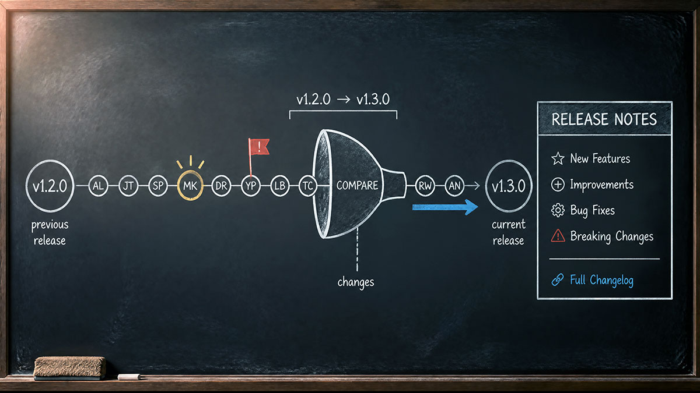

# Git Remote Release



This skill generates polished GitHub release notes from the commits and pull requests between two tags, two branches, or the current branch and the upstream default branch. It produces a human-friendly summary optimized for release notes, not a raw commit log.

When explicit tags or a compare URL are provided, the skill works entirely through GitHub's API — no local clone is needed. When no input is provided, the skill detects the current Git working repository and resolves the comparison range from local branch and remote state.

## Evidence collection gate

When Python 3 and authenticated `gh` are available, run the bundled `scripts/collect-release-evidence.py` after resolving the range. This is the default collection path. It expands squash merges into original PR commits, checks counts, preserves final file patches, and builds contributor-complete source lines. A PR opener alone cannot establish who contributed.

```text
python <skill-directory>/scripts/collect-release-evidence.py collect <owner/repo> <previous-ref> <current-ref> --output <temporary-directory>/release-evidence.json
```

Use an absolute skill path and an output directory under the operating system's temporary directory, or the repository's ignored `.bot/` directory. The collector only reads GitHub through `gh api` GET requests and writes the requested evidence file. It does not change Git configuration, refs, or remote content. It requires Python 3.9+ and a `gh` version supporting `--paginate --slurp`.

Read the resulting `commits`, every `pull_requests[].commits`, and final `files` before writing the summary. Use `sources` verbatim in the Sources section. The opening PR body is context, not the change inventory. Check each meaningful final file change against the summary. Inspect `files_without_patch` through another read-only route when needed; binary files and omitted patches still require consideration. Distinguish repository test/build tooling changes from changes to dependencies shipped to package consumers before claiming a breaking change.

Exit code 1 or `complete: false` means collection is incomplete. Read `issues` and resolve the missing evidence through another read-only route, or explicitly report incomplete sources. The collector deliberately leaves ambiguous rebase/partial integrations and comparison file inventories at the API cap for review. Never silently remove an issue, use an older output after a failed invocation, or treat an unverified commit as a direct source.

Save the draft beside the evidence and check it before returning:

```text
python <skill-directory>/scripts/collect-release-evidence.py verify <temporary-directory>/release-evidence.json <temporary-directory>/release-notes.md
```

Fix source omissions, extra source entries, contributor changes, and format errors until verification succeeds. This checks attribution and format, not whether prose covers every change or correctly describes its impact. Incomplete evidence cannot pass this gate; report that limitation rather than claiming verification passed. If Python/`gh` is unavailable, refs exist only locally, or the user supplies an offline snapshot, follow the manual workflow below with the same count and contributor checks. State the collection limitation; do not quietly skip PR commit expansion. Never call an AI service from either script.

## Input

The skill accepts input in three ways, checked in this order:

**1. Compare URL:**

When the user provides a GitHub compare URL like `https://github.com/codebeltnet/agentic/compare/v1.0.0...v1.0.1`, extract the owner, repository, previous ref, and current ref from it.

**2. Separate values:**

- Repository in `owner/repo` format (e.g. `codebeltnet/agentic`)
- Previous ref — a tag (e.g. `v1.0.0`) or branch name
- Current ref — a tag (e.g. `v1.0.1`) or branch name

**3. Default resolution (no input provided):**

When the user does not provide an explicit repository, tag range, compare URL, or branch name, the skill operates on the current Git working repository. See **Default Resolution Behavior** below.

If any required value is missing and cannot be inferred or resolved, ask the user for it before proceeding.

## Default Resolution Behavior

If the user does not provide an explicit repository, tag range, compare URL, branch name, or release range, the skill must operate on the current Git working repository.

In that case, the skill must:

1. Detect the current branch.
2. Detect the upstream remote for the repository.
3. Detect the upstream repository's default branch — usually `main`, but do not assume `main` if the remote default branch can be resolved.
4. Compare the current branch against the upstream remote default branch.
5. Include all commits on the current branch that are not present in the upstream remote default branch.
6. Include all contributors represented by those commits or associated pull requests.
7. Generate the release-note optimized summary from that comparison.

The default comparison should be conceptually equivalent to:

```text
upstream/default-branch...current-branch
```

For example, if the current branch is `feature/git-remote-release` and the upstream default branch is `main`, the comparison should be treated as:

```text
upstream/main...feature/git-remote-release
```

If the repository uses `origin` as the upstream remote, use:

```text
origin/main...current-branch
```

If the repository has both `origin` and `upstream`, prefer the remote that represents the canonical source repository. In fork-based workflows, this is usually `upstream`. In single-repository workflows, this is usually `origin`.

The skill must not silently assume the wrong base branch. If the default branch cannot be resolved, fall back in this order:

1. `origin/HEAD`
2. `upstream/HEAD`
3. `origin/main`
4. `origin/master`
5. `upstream/main`
6. `upstream/master`

If none of these can be resolved, ask the user to provide the base branch or compare URL.

Useful commands for default resolution:

```bash
git rev-parse --abbrev-ref HEAD
git remote
git symbolic-ref refs/remotes/origin/HEAD --short
git symbolic-ref refs/remotes/upstream/HEAD --short
git merge-base HEAD {resolvedBase}
git log --oneline {resolvedBase}..HEAD
```

## Contributor Handling

Contributor attribution should be based on available GitHub metadata when possible. If GitHub metadata is unavailable, use Git commit author information.

For a PR source, use the PR's REST `user.login` exactly, including a GitHub App user's `[bot]` suffix. For a direct commit, use REST `author.login`, not `committer.login` or the nested Git author display name. Never derive a login from an app slug, display name, email, or profile URL. `gh pr view --json author` can return `app/codebelt-aicia` where REST returns `codebelt-aicia[bot]`; verify bot or ambiguous identities with `GET /repos/{owner}/{repo}/pulls/{number}` before rendering. Do not strip or invent `[bot]`.

The `Sources:` section must preserve contributor attribution using this format when a GitHub username is available:

```
* <title> by @<author> in <pull-request-or-commit-url>
```

If a GitHub username is unavailable, use the commit author name without the `@` prefix:

```
* <title> by <author-name> in <commit-url-or-sha>
```

For every input mode, collect contributors from the PR author, every included PR commit's REST `author.login`, and verified co-authors. A squash commit and the PR opener are not a complete contributor inventory. Never filter collection or summarization by author, bot status, or the account that opened the release PR. Preserve distinct accounts such as `codebelt-aicia[bot]` and `aicia-bot`; a Git display name like `aicia[bot]` does not replace REST `author.login`.

Render each source once with its unique verified contributors after `by`: `* <title> by @<pr-author>, @<contributor> and @<contributor> in <pr-url>`. Put the PR author first, then other contributors in first-commit appearance order. For two contributors use `and`; for one retain the existing single-author format. Deduplicate logins case-insensitively while retaining the API spelling. If a co-author or commit author cannot be mapped to a GitHub login from authoritative metadata, credit the recorded name without inventing an `@` handle. Do not use repository-wide contributor lists, reviewers, commenters, or the merge actor as substitutes for evidence of authorship in this range.

## Workflow

### Step 1: Resolve the input parameters

Determine which input path applies:

- **Compare URL provided:** Extract owner, repository, previous ref, and current ref from the URL.
- **Separate values provided:** Use the supplied repository, previous ref, and current ref.
- **No input provided:** Follow the Default Resolution Behavior to detect the current branch, upstream remote, and base branch from the local Git working repository.

Validate that the repository exists and both refs are reachable before continuing.

### Step 2: Collect commits in the comparison range

Fetch all commits included in the range `previousRef...currentRef` using the GitHub API or local Git commands. For each commit, collect:

- Commit SHA
- Commit message (subject and body)
- Author login

### Step 3: Collect pull requests

For every commit SHA in the complete range, query `GET /repos/{owner}/{repo}/commits/{sha}/pulls` and follow all pagination links. A commit subject without a PR number is not evidence that it was committed directly. Keep each SHA's lookup status and qualifying PR URLs so failed or skipped lookups cannot become direct-commit sources.

Keep merged PRs whose base repository matches the release repository and whose integration belongs to the comparison range. Use `merged_at` and `merge_commit_sha`, checking the latter against the range. For squash or rebase histories where that check does not establish inclusion, verify the associated PR's commits and reachability against the resolved refs. Do not require a merge-commit subject or use merge dates alone. Exclude open, unmerged, unrelated, and later-merged PRs; do not select the first API result blindly. If multiple PRs qualify, retain each one. If inclusion remains ambiguous, report unresolved source data instead of guessing.

Collect unique pull requests only. If multiple commits map to the same pull request, record that pull request once and preserve all contributing commits through the single PR source entry.

For each pull request, collect:

- PR number and title
- Author login
- PR URL
- PR description/body
- Labels
- Every original PR commit, including full messages, REST author identities, and co-author trailers
- Complete changed-file inventory and relevant patches

For each qualifying merged PR, fetch `GET /repos/{owner}/{repo}/pulls/{number}/commits` with pagination and compare the collected count with the PR's `commits` field. This is mandatory even when the tag range contains only one squash commit. Original PR commits may have different SHAs from the squash commit; use the verified PR integration to establish their membership, rather than dropping them because their SHAs are absent from the tag comparison. For a partially included PR, include only the changes and authors verified in the selected range. Honor endpoint caps; a count mismatch requires another read-only route or an explicit incomplete contributor/change inventory.

Use a commit source only after a successful, fully paginated lookup and relevance checks establish that no qualifying PR covers it. A PR source replaces its covered commit links, including the squash or merge commit. It does not replace their change evidence or contributor identities. Include those contributors on the PR source line; do not duplicate covered commit links just to credit them.

Authentication errors, rate limits, missing tool capabilities, truncated responses, and failed PR-detail requests mean unresolved metadata, not "no PR". Try another available read-only GitHub route or retry as appropriate. If still unresolved, clearly mark the Sources section incomplete before the final changelog link and identify affected SHAs. Do not silently emit commit substitutes or claim complete resolution.

### Step 4: Analyze and summarize

Read through all collected pull requests and commits. Understand what changed, why it matters, and how it affects users and maintainers. Group related changes together. Identify breaking changes, new features, bug fixes, dependency updates, CI/CD changes, documentation updates, and infrastructure work.

Read original PR commit messages and the final comparison's changed-file inventory and relevant patches before drafting. Fetch paginated PR files or individual file/commit diffs when the compare response is capped or omits a needed patch. PR titles, automated PR bodies, and package release notes may describe only the initial change and become stale after later commits. Resolve discrepancies against the final diff; use commit messages for intent, and do not describe reverted intermediate work as shipped. Build a compact evidence inventory connecting each meaningful change to its files and commits, then check that the summary covers it. One source URL can represent many changes by several people. Never reduce an entire service PR to dependency updates solely because its title or opening body says so.

The summary should explain the effect of the changes, not just the implementation. A good release note tells users what they can expect from this version, not just what code was modified.

### Step 5: Compose the release notes

Follow the exact output format defined below. Every release note must start with `## What's Changed` and end with the full changelog link. Nothing may appear after the changelog link.

## Output Format

```markdown
## What's Changed

<optimized-summary>

<optional-alert-blocks>

Sources:

* <title> by @<author> in <url>
* <title> by @<author> in <url>

**Full Changelog**: https://github.com/{owner}/{repo}/compare/{previousRef}...{currentRef}
```

### The summary section

The summary is the heart of the release note. It must be:

- **Human-friendly** — written for someone scanning the release to understand what changed
- **Effect-oriented** — explains what users and maintainers can expect, not just what was modified
- **Evidence-backed** — every claim must be supported by the commits or pull requests collected
- **Grouped logically** — related changes are discussed together, not listed chronologically
- **Honest** — no invented impact, no unsupported claims, no vague filler like "various improvements"

For small releases (a handful of changes), prefer a concise paragraph or short bullet list.

For larger releases, prefer grouped bullets organized by theme: new features, fixes, infrastructure, breaking changes, etc.

Avoid simply repeating PR titles or commit messages unless they are already clear and release-note friendly. Rewrite them into prose that explains the effect.

### Key capabilities formatting (when included)

When the release note includes a "Key capabilities" section, each bullet must be written as a natural sentence with a bolded lead-in.

Do not use a bold label followed by an em dash, colon, or definition-style fragment.

Avoid this style:

```markdown
- **Thematic grouping** — Related changes are discussed together instead of listed chronologically
```

Use this style instead:

```markdown
- **Thematic grouping** where related changes are discussed together instead of listed chronologically,
```

The bold text should highlight the capability name, but the full bullet must read as one natural sentence.

Preferred pattern:

```markdown
- **<Capability name>** where/that/so/with <natural sentence continuation>,
```

End each bullet with `,` except the final bullet in a populated section, which must end with `.`.

### GitHub alert blocks (optional)

Alert blocks draw attention to information that deserves special notice. Use them sparingly — prefer zero to two per release. Only include alerts when the release data genuinely supports the attention level.

Alert blocks appear after the summary and before the `Sources:` section.

**When to use each alert type:**

`> [!NOTE]` — Helpful context, compatibility notes, clarifications for skimmers, non-breaking behavior explanations.

`> [!TIP]` — Recommended usage, easier migration paths, better ways to use a new or changed feature, practical follow-up actions.

`> [!IMPORTANT]` — New capabilities users should notice, required configuration changes, important behavior changes, major release highlights.

`> [!WARNING]` — Breaking changes, deprecated behavior that may affect users soon, changes that can cause builds, tests, runtime behavior, or integrations to fail if ignored.

`> [!CAUTION]` — Security-sensitive changes, data loss risks, removal of functionality, operational risks, changes where misuse can lead to negative outcomes.

Do not invent alerts. Do not add a `WARNING` or `CAUTION` unless the release data supports that level of attention. Breaking changes should normally use `WARNING`. Security-sensitive or risk-heavy changes should normally use `CAUTION`.

### The Sources section

The `Sources:` section preserves the original references that informed the summary. This gives readers a path to the raw details if the summary is not enough.

Each source entry follows this format, expanding `<author>` to the verified contributor list defined in Contributor Handling:

```
* <title> by @<author> in <url>
```

For pull requests, use the PR title and PR URL:

```
* Add validation for skill templates by @gimlichael in https://github.com/codebeltnet/agentic/pull/19
```

Preserve GitHub App authors exactly. For example, when the API resolves the release commit to PR #38:

```markdown
* V10.1.8/service update by @codebelt-aicia[bot] in https://github.com/codebeltnet/newtonsoft-json/pull/38
```

Do not substitute its commit URL or shorten the author to `@codebelt-aicia`.

When a PR includes commits from multiple accounts, retain them on that same source line. For example, PR #34's original commits verify all three accounts here:

```markdown
* V10.0.12/service update by @codebelt-aicia[bot], @aicia-bot and @gimlichael in https://github.com/codebeltnet/aws-signature-v4/pull/34
```

For direct commits without a PR, use the commit subject and commit URL:

```
* Fix script path handling by @gimlichael in https://github.com/codebeltnet/agentic/commit/abc123def
```

List every pull request and direct commit that contributed to the release. Do not omit sources.

### The changelog link

The final line of the release note must always be:

```
**Full Changelog**: https://github.com/{owner}/{repo}/compare/{previousRef}...{currentRef}
```

When comparing tags, use the tag names (e.g. `v1.0.0...v1.0.1`). When comparing branches from default resolution, use the branch names (e.g. `main...feature/my-branch`).

Nothing may appear after this line.

## Non-Negotiable Rules

- The first line of the output is exactly `## What's Changed`.
- The summary covers all meaningful changes in the comparison range.
- The summary is optimized for GitHub release notes, not raw commit history.
- Alert blocks are included only when they add value and are supported by the release data.
- Alert severity matches the actual impact of the change.
- The `Sources:` section is always included.
- Source entries use the `* <title> by <contributors> in <url>` format. Include all verified source authors with exact `@login` values, falling back to recorded names when a GitHub login is unavailable.
- The final line is the full changelog link in the exact format shown above.
- Nothing appears after the full changelog link.
- No unsupported claims are invented.
- Breaking changes, if any, are clearly identified.
- Vague wording like "various improvements" or "miscellaneous changes" is avoided.
- The skill prefers pull request metadata over raw commits when available.
- Direct commits are used only after successful association checks establish no qualifying PR. Unavailable metadata is reported as incomplete.
- PR source authors preserve the exact REST `user.login`, including `[bot]`.
- Related changes are grouped in the summary rather than listed chronologically.
- The summary explains the effect of changes, not just the implementation.
- Dependency, build, test, documentation, CI/CD, and infrastructure changes are included when meaningful.
- The skill does not mutate any repository state — it is entirely read-only.
- When no explicit input is provided, the skill follows the Default Resolution Behavior instead of asking the user for a repository or tag range.
- All contributors in the comparison range are represented in the Sources section.

## Data Collection Strategy

The skill uses GitHub's API and local Git commands to gather data. The preferred approach depends on the input path and what tools are available.

**When explicit tags or a compare URL are provided**, use GitHub's API. The preferred approach depends on what tools are available in the agent environment.

Use the bundled collector when its prerequisites are available. Otherwise, when GitHub MCP tools are available (such as `github_list_commits`, `github_get_commit`, `github_pull_request_read`), use them directly with the same completeness checks. They provide structured data without requiring shell access.

When `gh` CLI is available, use these commands:

```bash
gh api --paginate "repos/{owner}/{repo}/compare/{previousRef}...{currentRef}?per_page=100"
gh api --paginate "repos/{owner}/{repo}/commits/{sha}/pulls?per_page=100"
gh api repos/{owner}/{repo}/pulls/{number}
gh api --paginate "repos/{owner}/{repo}/pulls/{number}/commits?per_page=100"
gh api --paginate "repos/{owner}/{repo}/pulls/{number}/files?per_page=100"
```

Use REST `title`, `html_url`, `user.login`, `user.type`, `merged_at`, `merge_commit_sha`, `base.repo.full_name`, `body`, and `labels` from PR responses. Keep the raw identity fields even if another tool supplies summaries. Batch independent commit-association requests when supported, with at most four in flight; honor rate-limit responses. Resolve pagination and dependent PR checks before composing sources, then order sources by first appearance in the comparison and PR number for ties.

The endpoint's inclusion rules are documented in [GitHub's associated pull requests API](https://docs.github.com/en/rest/commits/commits#list-pull-requests-associated-with-a-commit). It can return open PRs for commits outside the default branch, so association alone does not prove release inclusion.

The GitHub compare API can return fewer commits than the range contains. After fetching a compare response, compare `total_commits` with the number of collected `.commits[]` entries. If `total_commits` is greater than the collected commit count, fetch remaining pages when possible; otherwise warn the user that commit data is capped and do not present the `Sources:` section as complete.

**When using default resolution (no explicit input)**, combine local Git commands with GitHub API. First resolve the base branch (see **Default Resolution Behavior** above), then substitute the resolved value into `{resolvedBase}` — do not hardcode `origin/main`:

```bash
git rev-parse --abbrev-ref HEAD
git remote
git symbolic-ref refs/remotes/origin/HEAD --short
git log --oneline {resolvedBase}..HEAD
git log --format="%H%x09%an%x09%ae%x09%s%x09%b" {resolvedBase}..HEAD
```

Then use the GitHub API to enrich local commit data with pull request metadata, labels, and descriptions.

**When neither is available**, guide the user to install `gh` or authenticate with GitHub.

For each commit in the compare range, check whether it belongs to a pull request. GitHub's API can resolve this through the commit's associated pull requests endpoint. Use verified PR metadata for the source title and URL, original commits for authorship and intent, and the final diff for what shipped.

## Quality Checklist

Before returning the result, verify:

1. The first line is exactly `## What's Changed`.
2. The summary is human-friendly and optimized for GitHub release notes.
3. The summary covers the meaningful changes in the comparison range.
4. GitHub alert blocks are included only when they add value.
5. Alert severity matches the actual impact of the change.
6. Alert blocks are supported by the release data.
7. A `Sources:` section is included with all contributing PRs and commits.
8. Source entries use the `* <title> by @<author> in <url>` format, with fallback to author name when no GitHub username is available.
9. All contributors in the comparison range are represented in the Sources section.
10. The final line is the full changelog link.
11. Nothing appears after the full changelog link.
12. No unsupported claims were invented.
13. Breaking changes, if any, are clearly identified.
14. When using default resolution, the comparison range correctly reflects the current branch against the upstream default branch.
15. Every commit has a completed association lookup; unresolved or capped data is explicitly marked incomplete.
16. Every qualifying PR appears once, no covered commit is also listed, and no unrelated or unmerged PR is included.
17. PR titles, URLs, and author logins match REST metadata exactly, including `[bot]`; no normalized app slug replaces a bot login.
18. Each qualifying PR's original commit inventory is complete, and every verified author/co-author is credited on its source line, even for squash merges and automated release PRs.
19. The summary covers meaningful final changes across all authors and changed files; stale PR descriptions do not override diff evidence.
