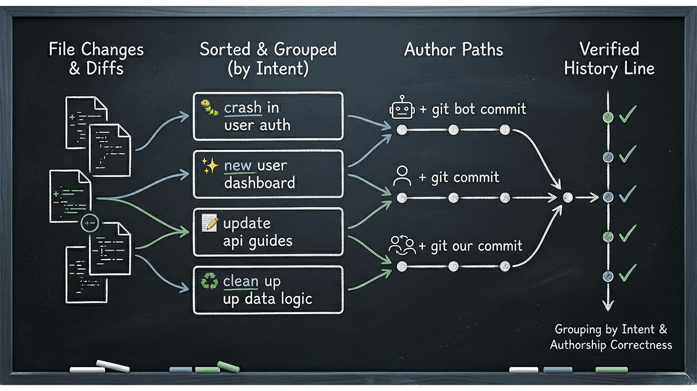

# Git Visual Commits



This skill drives the entire git commit workflow — reviewing changes, grouping them logically, composing messages with the right emoji, and only adding a conventional prefix when the user explicitly asks for that combo. It supports three identity modes: bot-attributed (`git bot commit`), human-attributed (`git commit`), and collaborative (`git our commit`).

## Critical Rules

### Invocation Routing Lock

- An explicit `git bot commit`, `git commit`, or `git our commit` phrase is an authoritative request to use this skill. Do not substitute a changelog, release-note, squash-summary, or generic commit workflow.
- Interpret `Please do a git bot commit yolo` as `git bot commit` identity plus auto-approval for the full current worktree. `yolo` is not the commit message, and it does not request a changelog.
- That exact combination is also an instruction to complete the commit workflow in the current turn after the required checks pass. Treat the visible plan as status information, not as a request for another approval; do not end with a pending plan or ask whether to proceed.
- Equivalent word order and punctuation, such as `git bot commit, yolo` or `yolo — do a git bot commit`, preserve the same routing when both the explicit commit command and modifier are present.
- A competing skill may run only when the user also explicitly requests its distinct output, such as updating `CHANGELOG.md`, drafting release notes, or producing a squash summary.

### Full-Skill Read and Subject Lock

Before running any Git command or composing a subject, read this `SKILL.md` completely from the first line through EOF. A metadata preview, excerpt, cached recollection, or partial read is not sufficient. If a tool truncates the file, continue from the first unread line until EOF before proceeding.

The first visible character after the emoji and its single separator space must be lowercase. This is a blocking requirement, not a style suggestion. Every proposed subject must have this exact default shape:

```text
<approved-emoji><one ASCII space><lowercase-beginning description>
```

After selecting the emoji from the bundled `references/commit-language.md`, run the bundled deterministic validator before showing the subject in a plan and again immediately before passing it to Git:

```powershell
pwsh -NoProfile -File <skill-root>/scripts/validate-commit-subject.ps1 -Subject '<subject>'
```

Only when the user explicitly requested the conventional-prefix combo, add `-PrefixMode Required`. Resolve `<skill-root>` from this skill's installed directory, not from the current repository. The validator must exit successfully. If it fails, correct the subject and rerun it; never show, commit, or preserve the invalid subject. `yolo` and `auto` do not bypass the full-read or subject-validation locks.

The validator enforces an emoji present in the bundled reference table, exactly one ASCII space after it, a lowercase first description character, the opt-in prefix contract, and the 70-character maximum. Semantic emoji selection still comes from reading the reference and inspecting the actual diff.

### Identity Lock

- If the user asked for `git bot commit`, you must use `git bot commit`.
- If the user asked for `git commit`, you must use `git commit`.
- If the user asked for `git our commit`, follow the attribution workflow and then use the matching command per group.
- Never silently downgrade a requested `git bot commit` to `git commit`.
- If the required `git bot` alias is unavailable, halt and report that exact blocker instead of falling back to human identity.

### Direct Git Execution Rule

- For identity-sensitive commit work, prefer direct shell or terminal execution of git commands over wrapper tools that might bypass aliases, rewrite commit behavior, or hide the exact command being run.
- Before the first commit, verify that your chosen tool path can truly execute the required command form, especially `git bot commit`.
- If a wrapper tool cannot execute git aliases faithfully or cannot prove which command it will run, do not use it for this skill's commit step.
- Do not mix execution paths casually mid-stream. Pick one direct git execution path for the commit flow unless a verified blocker forces a pivot.

### Fail-Fast Tool Validation

- Validate the commit path before creating the first commit: confirm alias availability, confirm the tool can execute the requested identity mode, and confirm you can run the post-commit verification commands.
- If the first attempt produces the wrong author, wrong body format, or another identity-path mismatch, treat that as a tool-path failure rather than a one-off typo.
- Pivot immediately to a direct shell or terminal git path instead of retrying with the same broken wrapper.
- Do not spend multiple amend attempts trying to compensate for a tool that cannot faithfully execute the requested command.

### Auto-Approval Guard

`yolo` / `auto` skips user confirmation only. It never skips:

- skill activation
- the full-skill read
- identity selection
- semantic grouping
- mixed-scope validation
- deterministic subject validation
- post-commit author verification
- In auto-approval mode, the user's `yolo` or `auto` is already the approval for this commit request. After the required checks pass, execute the commit command(s) in the same turn. Do not ask "Proceed?", "Should I commit?", or any equivalent confirmation question, and do not return a plan as if approval were still pending. Stop only for a concrete blocker such as a missing alias or failed validation, and report that blocker directly.

If the user did **not** say `yolo` or `auto`, and session-level auto mode is not already enabled, do **not** run any commit command yet. You must stop after Step 4, present the plan, and wait for approval.

### Default Scope Rule

If the user says `git bot commit`, `git commit`, or `git our commit` without narrowing language, treat the request as covering the full current worktree.

- The default scope is **all current changes visible in git status**.
- Your job is to group that full worktree into the right number of commits by semantic intent.
- Never silently narrow the scope to "just the files from the last thing I worked on", "just the files I touched", or "just the newest skill" unless the user explicitly said to do that.
- `yolo` keeps this same full-worktree default. It removes the approval wait; it does not narrow scope.

Narrow scope only when the user explicitly does one of these:

- names a specific path, file, module, project, or technology slice
- says `just`, `only`, `for this`, `for X`, `commit the README changes`, or equivalent limiting language
- asks for a review/plan for a subset before committing

If the user did not narrow scope, do not invent a narrower scope on their behalf.

### Recovery Safety Rule

- Before any destructive recovery command, inspect the current git state again with commands such as `git status`, `git diff`, `git diff --staged`, and when relevant `git reflog`.
- Prefer non-destructive recovery first: targeted unstaging, precise re-staging, or `git stash` when you need to preserve work before changing tactics.
- Do not use broad restore or hard reset commands as a first recovery move just because a commit attempt went wrong.
- If recovery is needed because the execution path itself was wrong, stabilize the worktree first, then switch tools; do not continue digging with the same failing approach.

### Approval and Clarification Lock

- User feedback that something is "wrong" is not, by itself, permission to edit files, revert changes, amend commits, or regroup the plan.
- If the feedback could refer to multiple things such as the emoji, prefix, subject, body, grouping, or the underlying code change, ask one concise clarification question before changing anything.
- Preserve the current approved worktree and staged state until the user explicitly asks for a fix, revert, amend, or regrouping.
- Do not treat frustration, urgency, or strong wording as implicit authorization to undo work on the user's behalf.

### Commit Language Lock

- Read `references/commit-language.md` in the current session before choosing any emoji or prefix.
- Resolve that path from this skill's own bundled `references/` directory or installed skill folder first. Do **not** reinterpret it as a repo-root `references/commit-language.md` path unless the user explicitly points you there.
- If the current repository has no `references/commit-language.md` file but the bundled skill reference is available, that is **not** a blocker. Read the bundled skill resource and continue.
- If that reference is unavailable or unreadable, stop and report the blocker instead of guessing.
- Default to `<emoji> <short description>`. Do not add a prefix after the emoji unless the user explicitly asked for a combo with conventional commits or conventional prefixes.
- Treat the inspected reference as the source of truth for emoji and prefix meaning. Correct mismatches before presenting the plan instead of waiting for the user to catch them.
- Treat community health, changelog, and release-status communication as `💬` intent by default. Do not collapse that category back into generic `📝` or `📚` docs wording when the main audience is humans reading repo health or release status.

### Post-Commit Verification

After every commit, run:

```bash
git log -1 --format="%an <%ae>"
```

Confirm that the author matches the requested identity mode. If the author is wrong, treat the commit as invalid and repair it before reporting success.

```bash
git log -1 --format=%B
```

If the body contains literal escape sequences such as `\n` instead of real line breaks, treat the commit message as invalid and repair it before reporting success.

### Umbrella Commit Rejection

Reject a single umbrella commit when the diff spans multiple intents such as:

- skill instructions (`SKILL.md`, `FORMS.md`, `references/`, `evals/`)
- scaffold/template/runtime files (`assets/`, scaffold helper scripts)
- validation/tooling (`scripts/`, repo validators)
- repo docs or repo policy (`README.md`, `AGENTS.md`, `CONTRIBUTING.md`)

`yolo`, small file count, or "the changes are related" are not valid reasons to collapse these into one commit.

## Prerequisites

The `git bot commit` command requires a one-time alias setup in your global git config. Run this once per machine:

```bash
git config --global alias.bot '!git -c user.name="<bot-name>" -c user.email="<bot-email>"'
```

Replace `<bot-name>` and `<bot-email>` with the identity you want AI-authored commits to appear under.

If `git config --global --get alias.bot` returns nothing when the user asked for `git bot commit`, stop and report that the bot alias is missing. Do not proceed with `git commit` as a fallback.

---

## When to use `git bot commit` vs `git commit` vs `git our commit`

In all cases, **the AI does all the work** — reviewing changes, grouping them logically, composing the message, staging files, and running the command. The only difference is which identity the commit is attributed to.

| | `git bot commit` | `git commit` | `git our commit` |
|---|---|---|---|
| **When** | User asks the AI to commit (e.g. "commit your changes", "do a git bot commit") | User asks to commit under their own identity (e.g. "please do a git commit") | User says "our commit" or the work was collaborative (both human and agent edited files) |
| **Who gets credit** | Bot alias (e.g. `aicia[bot]`) | Human's default git profile | Agent analyzes authorship, human picks attribution |
| **Command** | `git bot commit -m "..."` | `git commit -m "..."` | Either, based on human's choice |

### How `git our commit` works

When the user says "our commit", analyze which changed files were agent-authored, human-authored, or mixed/unclear. Group by semantic intent first, then assign each all-agent group to `git bot commit` and each all-human group to `git commit`. For mixed/unclear groups, ask who should be the author. Present the attribution beside every planned commit; the user may override it. Do not add `Co-authored-by` trailers because the pull-request flow already records collaboration.

The commit message format, emoji conventions, grouping strategy, and everything else is **identical** for both. The profile is the only thing that changes.

Never add or modify git remotes. Never set `git user.name` or `git user.email` locally.

---

## Commit Message Format

Default format:

```
<emoji> <short description>

<body>
```

Only when the user explicitly asks for an emoji plus conventional-commit combo:

```
<emoji> <prefix>: <short description>

<body>
```

- **Emoji** comes first — picked from `references/commit-language.md`
- **Prefix** is omitted by default. Only add one when the user explicitly asked for an emoji plus conventional-commit combo. When combo mode is active, the prefix is lowercase (see `references/commit-language.md`) — **never use `feat:`**
- **Description** begins with a lowercase letter, uses imperative wording, and keeps the full subject to at most 70 characters (including emoji and any explicit-request prefix)
- **Body** is included by default — a short paragraph explaining *why* the change was made, not just *what* changed. Separate from the subject with a blank line. Do **not** hard-wrap commit bodies at 72 characters; keep short bodies as normal prose and add line breaks only when they improve readability. Can be suppressed with `no-body` (see below).
- **Body repair rule** — if verification shows the stored body was split mid-sentence just to fit an arbitrary width, amend the commit before reporting success.
- One logical change per commit — don't bundle unrelated things

### Prefix and Emoji Reference

Read `references/commit-language.md` before choosing a prefix or emoji. It contains the allowed prefixes, the gitmoji-first table, and the extended emoji fallback guidance shared with `git-visual-squash-summary`. Keep that duplicated reference byte-for-byte aligned with the `git-visual-squash-summary` copy; the validator and CI both enforce that sync contract.

Treat `references/commit-language.md` as a bundled skill resource path, not as a repository-relative path. If a tool reports that the current repo lacks a top-level `references/` folder, re-check the skill resource location before declaring a blocker.

That reference now defines prefixes as opt-in. Unless the user explicitly asked for an emoji plus conventional-commit combo, keep subjects in the default `<emoji> <short description>` form. For community health, changelog, and release-status communication, prefer `💬` from that same reference rather than generic docs emoji.

### Source Discipline for Explanations

Anchor emoji, prefix, and grouping explanations to sources inspected in the current session. Distinguish verified sources from inference, and never claim that a document, attachment, screenshot, or image contained guidance unless you verified it.

---

## Auto-Approval Mode

`yolo` or `auto` inside an explicit commit request skips the Step 4 approval wait for that request. `enable yolo mode` or `enable auto mode` keeps it active until the user disables it. Auto-approval applies to all identity modes and skips confirmation only; every classification, grouping, subject-validation, identity, and post-commit check still runs. Show the plan before proceeding:

```
Auto-committing: 🔧 build/toolchain → 🚚 moved types → 💥 breaking shim removal → 💬 release notes
```

---

## No-Body Mode

Commits include a body by default. `no-body` or `tmi` suppresses it for one request; `enable no-body mode` or `enable tmi mode` keeps subjects-only until disabled. This mode suppresses only the body. Subject, emoji, prefix, classification, grouping, and validation rules still apply.

---

## Commit Workflow

### Step 1: Review changes

Run `git status` and `git diff` (and `git diff --staged` if there are staged changes) to understand what has changed.

Unless the user explicitly narrowed scope, inspect the **entire current worktree** and build the commit plan from that full set of changes. Do not default to the last task only.

Don't commit blindly — understand what each file is doing before grouping.

Before planning commits for `git bot commit` or other identity-sensitive flows, also verify the execution path itself: confirm the alias exists, confirm the chosen tool can execute it faithfully, and prefer a direct shell or terminal path when there is any doubt.
Read `references/commit-language.md` before drafting subject lines. If you cannot inspect that file in the current session, stop and report the blocker instead of guessing.
When resolving that reference, prefer the bundled skill path first instead of treating repo-root `references/` absence as a failure.

### Step 2: Classify changes

Before composing any commit message, bucket every changed file by its **semantic intent** — not just its file type. Read the actual diff for each file and ask: *"What is this change trying to accomplish?"* Two files of the same type (e.g. two test files) may have completely different intents and belong in separate commits.

Use the inspected commit-language reference as the meaning source, not your gut. For example, restructuring an existing skill's `SKILL.md`, `FORMS.md`, `references/`, or `evals/` is normally refactor intent and should map to `♻️`; configuration-file changes map to `🔧`; truly new repo or application capabilities map to `✨`.

#### Emoji Resolution: Common Mistakes

Sparkles (`✨`) is only for a capability that did not exist before. Do not use it for fixes, documentation, improvements to existing behavior, refactors, or tests. When two emoji seem plausible, use the reference meaning that most closely describes what the diff actually does.

Derive categories from the actual diff — don't assume a fixed set. Common categories include:

- **New repo capabilities** — introducing a new repo-managed skill, workflow, or top-level capability
- **Existing skill refactors** — restructuring or extracting shared rules from an already existing skill
- **Dependency/version baselines** — shared dependency manifests, package version props, runner-image version pins, or environment baselines that primarily align versions
- **Package/publish metadata** — release-note definitions, pack/publish targets, nuspec-like metadata, or files that define what a package publishes
- **Build/tooling** — CI workflows, container definitions, build scripts
- **Documentation publishing** — doc-site navigation, generated-doc assets, site branding, or files whose main job is to make published docs render correctly
- **Community health/release communication** — changelogs, support/contribution/community defaults, and other files whose main audience is humans reading repo health or release status; this bucket normally maps to `💬`

These categories are examples, not a fixed taxonomy. Reuse the *rationale* behind them even when another repo uses different filenames or technologies.

**Critical distinction:** "Environment/configuration" and "Test logic" are separate categories even when both live under a test project. A test environment config file (`testenvironments.json`, `appsettings.test.json`) describes *how tests run*. A test assertion file describes *what tests verify*. These are different intents.

**Repo-skill distinction:** Adding a brand-new skill folder is a **new repo capability**. Extracting shared wording, tightening an existing skill, or adding validator coverage for that skill is a different intent. Even when all of that work is related, do not collapse "new skill introduced" and "existing skill refactored" into one commit.

This classification drives grouping in Step 3. Files with different semantic intents almost never belong in the same commit.

### Step 3: Group into logical commits

Group changes by **semantic intent**, not just by file type or directory. Ask yourself: *"Could I explain each commit in one sentence without using the word 'and'?"* If you need "and" to describe what a commit does, it's likely two commits.

Temporal proximity is not a grouping signal. Changes made in the same round, same editor session, or same PR are still separate commits when their rationale, audience, or lifecycle role differs.

#### Semantic intent splitting

For every proposed commit, verify that all files share the same *rationale*. Prefer multiple commits when:

- One change is **environment/configuration** and another is **test logic or code behavior** — even if both are "test-related"
- The **explanation for why each file changed** differs materially
- One file changed because of an **operational/infrastructure decision** and another because of a **framework or API change**

When only two files changed but their rationales differ, **explicitly state that two commits are warranted** in the commit plan. Small file count does not justify bundling.

#### Single-category context quality gate

When more than one file is changed and your first classification puts every changed file into one semantic category or commit bucket, stop before Step 3 and run this gate. Exactly one changed file is the only fast-path exception; skip this gate for that case.

Ask yourself explicitly: **“Did I actually read the whole `git-visual-commits` skill through EOF in this session before classifying this change?”** A metadata preview, remembered rule, or partial read is a failed answer. If the answer is no or uncertain, read `SKILL.md` from its first line through EOF and restart Step 1 and Step 2.

Then re-check the complete `git status`, `git diff`, and applicable staged diff; enumerate every changed path; explain each path's rationale, audience, and lifecycle; and consider whether any path belongs to a different category such as documentation, configuration, tooling, validation, tests, or release communication. Re-read `references/commit-language.md` before confirming the category and emoji.

Only keep one category after this audit if every path still has one rationale. Put a visible line in the commit plan such as `Quality gate: 3 files, one category retained; full skill read, full diff review, per-file rationale check, and alternative-category check confirmed.` If any check fails or any file has a materially different intent, split the groups and rerun the normal validation. `yolo` and `auto` do not bypass this gate.

#### Commit body guidance

Unless **no-body mode** is active, every commit includes a body explaining the *why*:

- **Config/environment commits** → explain the operational intent (e.g. "Switch to shared-runner testing strategy with multi-image matrix")
- **Test assertion changes** → explain why the expectation changed (e.g. "net11 changed the default precision for DateTime, updating expected value")
- **Refactors** → explain what motivated the restructuring
- **New features** → explain the purpose and scope
- **Bug fixes** → explain what was broken and how this fixes it

Common groupings:
- New repo-managed skill or workflow introduction together
- Existing skill refactor or extraction together
- Dependency/version baseline updates together
- Package/publish metadata together
- Config/setup files together (app host, bootstrapping)
- Environment and infrastructure config together (test runners, CI matrix, container settings)
- Documentation publishing fixes together
- Community health or release communication docs together
- New feature or module code together
- Data contracts, types, and interfaces together
- Database models, migrations, and schema changes together
- Test logic and assertions together (when they share the same rationale)
- Documentation and inline comments together

When in doubt, one commit per "thing that changes" is better than one big commit.

#### Mixed-scope guard

After grouping, validate each proposed commit. If a single commit contains files from **three or more different categories** from Step 2 (e.g. docs + package props + solution files + API removals), **force a split**. A commit that touches documentation, build configuration, and source code at the same time is almost always an umbrella commit that should be broken apart.

This guard runs unconditionally — including in auto-approval mode.

#### Documentation separation rule

Documentation files (`CHANGELOG.md`, `AGENTS.md`, `README.md`, `CONTRIBUTING.md`, release notes) are **separate-by-default**. They only belong in the same commit as non-doc files when the commit is explicitly documentation-focused (e.g. `📝 add api usage guide` where the docs are the point, not a side effect).

#### Release-adjacent splitting rule

Do not treat "all of this supports the release" as one commit. Release-adjacent work often spans different audiences and lifecycle roles that deserve separate history:

- **Dependency/version baselines** — version alignment or runner baseline changes
- **Community health/release communication** — changelogs and human-facing repo health docs
- **Package/publish metadata** — package release-note definitions, `.nuget/*/PackageReleaseNotes.txt`, and publish targets; this bucket normally maps to `📦`
- **Documentation publishing** — DocFX navigation, branding, or publishing assets
- **CI/automation** — workflows and helper scripts used only by automation

These buckets are examples, not a fixed file map. The rule is the abstraction: split by purpose and audience, not by the fact that the changes landed together.

Concrete example: if one diff updates `Directory.Build.targets`, `Directory.Packages.props`, or `testenvironments.json`, another diff updates CI scripts or workflow files such as `bump-nuget.py` or `.github/workflows/*.yml`, and another diff updates `CHANGELOG.md` plus `.nuget/*/PackageReleaseNotes.txt`, that is at least three intents:

- **Build system / dependency baseline**
- **CI or automation**
- **Release communication plus package metadata**

Do not collapse those into one commit, even if they were edited in the same round and all support the same release. Keep `.nuget/*/PackageReleaseNotes.txt` with the `📦` package/publish commit, not with the `💬` community-health commit.

#### Repo-aligned grouping example

When a repo like this one mixes skill changes, scaffold assets, validators, and repo docs, split them by intent:

- **New repo-managed skill** — a newly introduced `skills/<name>/` folder and its local `evals/` or `references/`
- **Existing skill refactor** — extracting shared rules, renaming sections, or reorganizing an existing skill
- **Skill contract files** — `SKILL.md`, `FORMS.md`, `references/`, `evals/`
- **Template/runtime files** — `assets/`, scaffold helper scripts
- **Validation/tooling** — validator scripts, repo checks
- **Repo docs/rules** — `README.md`, `AGENTS.md`, `CONTRIBUTING.md`

Do not merge these into one commit unless the diff is truly single-purpose and the explanation still fits one sentence without using "and".

If a commit both introduces a brand-new skill and refactors an existing skill to support it, prefer separate commits. "Related" is not enough — the repo history should make it obvious which commit added the capability and which commit reorganized existing behavior around it.

#### Rename vs removal distinction

Treat **renamed/moved source files** and **removed type-forwarding or compatibility metadata** as different signals — never group them together:

- **Renames** (file moved, namespace changed, `using` updated) → move/refactor commit (`🚚` or `♻️`)
- **Removed forwarding** (deleted `[TypeForwardedTo]`, removed public-API compatibility shims, dropped re-exports) → breaking-change commit (`💥`)

Even when renames and removals happen in the same PR, they represent different intents and must be separate commits.

### Step 4: Present commit plan for review

Before staging or committing anything, present the full commit plan to the user. For each proposed commit, show:

```
1. 🚚 rename auth module to identity
   Files: src/Auth/ → src/Identity/, README.md

2. ✅ add integration tests for identity module
   Files: tests/Identity.Tests/
```

Before you render that plan, validate every proposed emoji and every proposed prefix against the inspected `references/commit-language.md`, then run `scripts/validate-commit-subject.ps1` for every exact subject. Fix failures before the user sees them. If the user did not explicitly ask for a conventional-commit combo, strip prefixes from the proposed subjects before presenting the plan. A plan containing an unvalidated subject is invalid, including in auto-approval mode.

If auto-approval is **not** active, Step 4 is a hard stop. Do not stage, do not commit, and do not treat silence or momentum as approval.

**If auto-approval is active** (via "yolo"/"auto" keyword or session-level setting), display a one-line summary and proceed immediately to Step 5:

```
Auto-committing: 🔧 build config → 🚚 rename auth to identity → ✅ identity tests → 💬 update changelog
```

Even in auto-approval mode, surface the commit buckets explicitly before committing. Auto-approval removes the wait, not the planning step.

The summary is status output, not a review request. Step 5 is mandatory in the same turn once its preconditions pass: never ask "Proceed with committing these groups?" (or an equivalent question), wait for a reply, or finish with a pending commit plan.

If the user did not narrow scope, the plan you surface must account for the full worktree rather than an arbitrarily chosen subset.

**Otherwise**, wait for the user to confirm or adjust. They may say things like:
- "Looks good" → proceed to stage and commit
- "Change #1 to ♻️" → swap the emoji and re-present
- "Merge 1 and 2 into one commit" → regroup and re-present
- "Use refactor: prefix on #1" → adjust and re-present

Only proceed to Step 5 after the user approves the plan.

If the user's response is ambiguous, such as "4 is wrong now" or "that was fine before", do not guess whether the issue is the emoji, prefix, message body, grouping, or the underlying code change. Ask a short clarification question first and keep the worktree unchanged until they answer.

#### Commit-message validation

Before committing, validate each message against its file list:

- If the subject claims a breaking change or uses `💥`, most files must directly implement or document that break; split build, CI, environment, and unrelated tooling files.
- The subject must describe every staged file consistently. Split rename work from compatibility-shim removal.
- Validate the emoji meaning against the reference and the exact subject shape with the script. Correct mismatches before presenting the plan.

### Step 5: Stage and commit each group

For each group:
1. `git add <specific files>` — be precise, don't use `git add .` unless everything belongs in one commit
2. Compose the commit message (see format above)
3. Run `scripts/validate-commit-subject.ps1` again against the exact subject that will be passed to Git. Add `-PrefixMode Required` only for an explicitly requested combo. Do not run Git unless the validator exits successfully.
4. Run the appropriate commit command:
   - `git bot commit -m "<subject>"` — if the user asked the AI to commit (bot identity)
   - `git commit -m "<subject>"` — if the user asked to commit under their own identity
   - For `git our commit` — use whichever command matches the attribution the human chose
   - **With body:** use `-m "<subject>" -m "<body>"` to add the optional description paragraph

For `git bot commit`, use an execution path that can run the alias directly and transparently. If a wrapper tool cannot prove it will actually execute `git bot commit`, switch to direct shell or terminal execution before committing.

When a commit body spans multiple lines, use real multiline input such as multiple `-m` arguments or a shell construct that preserves actual line breaks. Do not pass literal `\n` escape sequences and assume the shell will rewrite them. Prefer grammatical sentence and paragraph breaks over column-based hard wrapping.

When the body is just one short explanatory paragraph, prefer a single natural prose line in the stored commit message. Do not press Enter mid-sentence to satisfy an arbitrary width target.

### Step 6: Verify

After committing, run `git log --oneline -5` to confirm the commit looks right. Read the stored subject with `git log -1 --format=%s` and run `scripts/validate-commit-subject.ps1` against that exact value. Then always run `git log -1 --format="%an <%ae>"` and verify that the author matches the requested identity mode before reporting success. Also run `git log -1 --format=%B` and verify the stored body contains readable prose with real line breaks, not literal escape sequences such as `\n`, and is not hard-wrapped mid-sentence just to satisfy a column limit. If any verification fails, amend the commit immediately instead of merely warning about it.

If verification fails because the commit path used the wrong author or ignored the requested alias, stop treating it as a message-tweaking problem. Correct the tool path first, preserve the worktree safely, and only then repair the commit.

---

## Good Examples

```
🎉 begin api project
✨ add submission endpoint module
🐛 handle null optional fields in dto
➕ add validation library
🐛 fix: handle null optional fields in dto   ← only when combo mode was requested
```

## Bad Examples (and why)

```
feat: add submission endpoint            ← "feat:" is not an allowed prefix
✨ Feat: Add Submission Module            ← uppercase, "Feat:" not allowed
💬 Update CHANGELOG for v10.0.10          ← uppercase description beginning
💬  update changelog for v10.0.10         ← more than one separator space
📋 update changelog for v10.0.10          ← emoji is absent from the approved reference table
🎉 initial commit with all files         ← vague, bundles everything
⚙️ config: setup api                     ← "config:" is not an allowed prefix
♻️ refactor: reorganize skill wording    ← bad default if the user did not ask for the combo
```

## Branching (for reference)

When explicitly requested, use `[version]/[description]` (for example `v1.2.0/admin-dashboard`). Do not create, rename, or delete branches unless the user explicitly asks.
