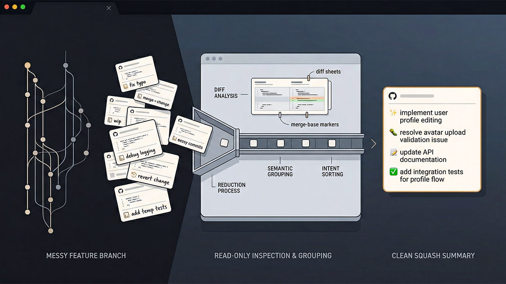

# Git Visual Squash Summary



This skill turns a stack of commits into a curated grouped summary without touching the index, the worktree, or git history. It is the wording companion to `git-visual-commits`: same emoji-first language, with conventional prefixes only when the user explicitly asks for that combo, but non-mutating and optimized for the grouped summary shown beneath a PR title or in a squash-and-merge description field.

This skill is non-mutating: it inspects history and diffs, then returns grouped summary lines only.

This skill has one job: produce a ready-to-paste squash-and-merge summary for the full current feature branch unless the user explicitly asked for a narrower range.

This skill answers one question: **What would this branch effectively do if it were squashed into one commit now?**

## Start Here: The First Response Is the Summary

Invoking this skill is the request. Nothing needs confirming, because the skill mutates nothing and the scope is derivable on your own: the current branch against its base branch. A confirmation round-trip costs the user a turn and returns no information you could not have resolved yourself with `git`.

So the first thing to do after loading this skill is run the read-only commands in Step 1 — not compose a reply. The first thing the user sees is the finished grouped summary.

A response from this skill is one of exactly three things:

1. The grouped summary lines. This is the normal case and covers nearly every invocation.
2. `No branch changes to summarize.` when every safe base-branch comparison is genuinely empty.
3. One direct question naming the missing base branch or range — only after the Step 1 fallbacks have all been tried and failed.

Everything else is a failed invocation, including:

- Reciting these instructions back as "I understand the instructions" or a list of "I will ..." promises. Quoting the rules is not evidence of following them; running the commands is, and the user cannot act on a restatement of your own prompt.
- Offering to do the thing already asked for: "Would you like me to generate a squash summary of your current branch now?"
- Announcing a plan and stopping before any `git` command has run.

If a sentence you are drafting starts with "I will" or "Would you like", delete it and run `git` instead. The summary is the acknowledgment.

## Deterministic Reduction Model

Use this model for every resolved scope:

```text
Result = semantic_delta(Base, HEAD)
History = provenance used to explain Result
```

History is evidence; the resulting state is truth.

Reduce first. Interpret second. Summarize last.

```text
resolve scope
    ↓
compute cumulative delta
    ↓
eliminate reverted / cancelled / superseded work
    ↓
identify surviving semantic outcomes
    ↓
consult history for intent and terminology
    ↓
group related surviving outcomes
    ↓
render grouped summary lines
```

Do not classify commit 1, then commit 2, then commit 3 and merge duplicate prose afterward. That approach preserves contradictory intermediate states.

## Non-Negotiable Rules

- Never stage, commit, amend, rebase, or otherwise mutate git state.
- Read `references/commit-language.md` before choosing any emoji or optional prefix.
- Keep `references/commit-language.md` byte-for-byte aligned with the `git-visual-commits` copy; the validator and CI both enforce that sync contract.
- Preserve technical identifiers exactly where possible.
- Group by intent, not chronology.
- Classify only changes that survive between the resolved base and `HEAD`.
- Retain only distinct high-signal change groups.
- Merge repetition and overlapping commits into their parent group.
- Drop low-signal noise such as typo-only, fixup-only, and trivial follow-up commits unless they materially change a retained group.
- Dependencies and version pins matter only when they survive into the final diff.
- Do not retain reverted experiments, temporary dependency upgrades, or removed late-stage implementations.
- Prefer strong concrete verbs and concise phrasing.
- Favor readable GitHub and terminal output over cleverness.
- Start the description after the emoji with a lowercase word unless the first word is a case-sensitive technical identifier.
- Avoid vague filler such as "various improvements".
- Do not treat the result as a changelog entry or a dump of commit subjects.
- Do not invent unsupported changes.
- Return grouped lines only, never a title or body.
- Keep every output line at or below 72 characters.
- For squash-and-merge requests that target the current branch, default to the full feature branch range from merge-base to `HEAD`.
- Treat branch topology as the scope source of truth, not author identity.
- Include commits from every author/contributor in the selected range. Do not filter to the current git user, current contributor, bot identity, configured author, or "my changes" unless the user explicitly asks for an author-filtered summary.
- A bare invocation such as `git-visual-squash-summary` or `/git-visual-squash-summary` is itself a complete request: resolve the current branch against the base branch, then return the grouped summary directly.
- Never require, infer, or ask for `yolo` / `auto`. Those modes approve mutating workflows; this skill is read-only and should act directly.
- Do not collect commit-set parameters through follow-up questions, widgets, or choice UIs for ordinary squash-and-merge requests.
- Do not answer an invocation with an acknowledgment, a restatement of these rules, or an offer to proceed. Run the commands and return the summary.
- Do not ask the user to choose between earlier branch commits and later branch commits such as changelog, version-bump, or release-finalization follow-ups. They are part of the branch unless the user explicitly narrows scope.
- Do not stop after comparing `HEAD` to a same-named tracking branch such as `origin/<current-branch>`. That only proves local sync with the remote copy of the feature branch, not that there is nothing to summarize.

## Workflow

### Step 1: Resolve the commit set

Resolve the commit set in this order:

1. If the user explicitly provided a commit range, branch comparison, PR branch, or base branch, use that.
2. Otherwise, for normal squash-and-merge, "summarize this branch", or bare skill-invocation requests, resolve the current branch and compare it to the repository's base branch.
3. Prefer the remote default branch, such as `origin/HEAD` resolving to `origin/main`, then try `origin/main`, `origin/master`, local `main`, and local `master` automatically.
4. Treat a same-named tracking branch such as `origin/<current-branch>` as a sync target only. Do not use it as the squash base unless the user explicitly requested that comparison.
5. If the first attempted comparison is empty but the current branch is not the base branch, try the remaining base-branch fallbacks before declaring there is nothing to summarize.
6. If you still cannot determine a safe comparison point after those silent fallbacks, stop and ask for the range or base branch instead of guessing.

Never turn steps 2 or 3 into a user-facing choice. Resolve them automatically and continue.
Never add `--author`, `--committer`, current-user, current-email, current-contributor, or identity-mode filters while resolving ordinary branch-level squash summaries. Author metadata may help understand ownership, but it must not narrow the default commit set.
Do not stop to ask whether the latest branch commit "should count". If it is on the branch, it is in scope by default.
Do not open with "What would you like me to summarize?" or "Would you like me to generate it now?" when the user invoked this skill directly or otherwise already asked for a squash summary. Both questions ask the user to repeat a request they already made.
If every safe base-branch comparison is genuinely empty, say `No branch changes to summarize.` and stop. Do not ask for a hypothetical range or demo.

Helpful read-only commands:

```bash
git status --short --branch
git rev-parse --abbrev-ref HEAD
git rev-parse --abbrev-ref --symbolic-full-name @{upstream}
git symbolic-ref refs/remotes/origin/HEAD --short
git merge-base HEAD @{upstream}
git merge-base HEAD origin/main
git merge-base HEAD origin/master
git merge-base HEAD main
git merge-base HEAD master
```

### Step 2: Inspect the cumulative branch delta first

Do not summarize from commit subjects alone when the range is noisy or long. Inspect the cumulative base-to-`HEAD` delta first so the final message reflects what actually survives.

Helpful read-only commands:

```bash
git diff --name-status -M -C <base>..HEAD
git diff --stat <base>..HEAD
git diff <base>..HEAD
git log --reverse --oneline <range>
git log --reverse --stat --format=medium <range>
git log --reverse --format="%h %an <%ae> %s" <range>
```

### Step 3: Collapse to semantic intent

Before drafting the summary, reduce the range into the smallest truthful set of retained groups:

- Start from the cumulative base-to-`HEAD` diff, not from commit labels.
- For every relevant file, dependency, version pin, config value, API, or behavior, decide what survives at `HEAD`.
- Eliminate exact reversions, temporary files/features, dependency churn that returned to the base value, and experiments abandoned before `HEAD`.
- Merge repeated fixes, redesigns, and follow-ups into the one surviving outcome they affected.
- If a feature or capability was absent at base and present at `HEAD`, describe it once in its final form. Intermediate fixes do not create extra lines.
- If a feature was added and later removed, omit it.
- If existing behavior changed and then reverted exactly, omit it.
- If a file or API was deleted and restored identically, omit it.
- If a file or API was deleted and recreated differently, usually describe one surviving modification or replacement, not naive removed-plus-added prose, unless the evidence clearly shows a different entity.
- If a path or entity moved or was renamed, describe it as one rename/move outcome when the cumulative diff supports that, not `Added` plus `Removed`.
- Dependency and version groups are important when they survive. Keep them separate from build-system/config/refactor groups when the final diff still shows a distinct surviving version change.
- A dependency or version that returns to the base value does not deserve a retained line.
- Do not absorb surviving package version updates into a generic build-system, configuration, or refactor line just because they landed in the same commit.
- When the diff mixes shared dependency manifests or version pins with build-system metadata or project-structure refactors, keep those as separate retained groups when both survive in the final diff.
- Keep documentation-only work separate in your reasoning, but include it only when it represents a meaningful unique change.
- Treat late changelog, version-bump, or release-finalization commits as part of the branch by default, then decide here whether they deserve a retained summary line or should be merged into a stronger parent group.
- Highlight distinct meaningful efforts instead of forcing one dominant umbrella theme.
- Use chronological history after this reduction to confirm rename intent, extract accurate terminology, understand bug context, and explain why the surviving outcome matters. Never let an intermediate commit override contradictory final-state evidence.

Reduction checklist:

- Does this exact change survive from base to `HEAD`?
- If several commits touched the same surviving outcome, can one line describe its final form truthfully?
- Are dependency/version changes still distinct in the final diff from build/config/refactor work?
- Does any candidate line rely on a commit message the final diff contradicts? If yes, trust the final diff.

Ask yourself: "If I had to explain the real work in 2-5 compact lines, what are the distinct changes that mattered?"

#### Emoji Resolution: Common Mistakes

**⚠️ Sparkles (✨) is often misused.** It is **only for 100% new feature introduction** — a capability that did not exist before. Do **not** use ✨ for:

- Bug fixes (use `🐛` or `🩹`)
- Documentation updates or skill description clarifications (use `📝`)
- Enhancements to existing features (still use `♻️`, `⚡️`, or feature-specific emoji)
- Refactoring existing code or skill content (use `♻️`)
- Adding tests for existing code (use `✅` or `🧪`)

**Examples of emoji resolution mistakes:**
- ❌ `✨ update git-keep-a-changelog skill description for clarity` → ✅ `📝 clarify git-keep-a-changelog skill description`
- ❌ `✨ improve error handling in parser` → ✅ `🐛 improve error handling in parser` or `♻️ improve error handling in parser`
- ❌ `✨ add unit tests for auth module` → ✅ `✅ add unit tests for auth module`

When in doubt between two emojis, pick the one whose meaning most closely matches **what the change actually does**, not what you hope it represents. Read the reference table carefully — each emoji has a specific scope.

### Step 4: Draft the grouped summary

Use this exact output shape:

```text
<emoji> <lowercase short summary line>
<emoji> <lowercase short summary line>
<emoji> <lowercase short summary line>
```

Formatting rules:

- Return grouped lines only. Do not prepend a title.
- Use one line per retained high-signal group.
- Keep every line at or below 72 characters.
- Default to emoji plus description only. Use `<emoji> <prefix>: ...` only when the user explicitly asked to mirror conventional-commit prefixes.
- Start each description lowercase after the emoji, usually with a lowercase imperative verb such as `add`, `update`, `refresh`, `preserve`, `split`, or `remove`.
- Preserve case-sensitive identifiers such as `ValidateSkillTemplates`, `Directory.Packages.props`, API names, type names, command names, and paths when they must appear first.
- Do not convert normal verbs to sentence case. Prefer `🧪 add ValidateSkillTemplates coverage`, not `🧪 Add ValidateSkillTemplates coverage`.
- Use the shared prefix and emoji guidance in `references/commit-language.md`.
- **Emoji correctness check (critical):** Validate every emoji against the reference file:
  - ✨ sparkles is **ONLY** for 100% new features that didn't exist before. If the summary line updates an existing skill, fixes a bug, clarifies docs, adds tests to existing code, or enhances existing features → use a different emoji (📝, ♻️, 🐛, ✅, etc.)
  - 📝 memo is appropriate for documentation updates, clarity improvements, and skill description changes
  - ♻️ recycle is appropriate for restructuring, refactoring, or reorganizing existing content
  - 🐛 bug is for fixes to broken behavior
  - ✅ check mark is for new test coverage
  - If an emoji doesn't fit the actual change, **swap it before presenting the summary**. Do not let the user catch emoji mistakes.
- If a retained line is primarily dependency or version-alignment work that still survives in the final diff, prefer the dependency emoji from the shared reference such as `⬆️`, `⬇️`, `➕`, `➖`, or `📌` rather than a generic config or refactor emoji.
- If a retained line is mainly changelog, community-health, or release-status communication, prefer `💬` from the shared reference rather than a generic docs emoji.
- Do not add bullets, numbering, a body, rationale paragraph, or chronology recap.
- Do not append weak glue like "with", "plus", or "and" just to force several top-level intents into one line.
- Favor clean lines that scan well in GitHub and terminal views.
- Condense to the real grouped effort without dropping important identifiers.

### Step 5: Return the grouped lines only

Output the finished grouped summary lines and stop. Do not run `git commit`, `git bot commit`, `git add`, or any other mutating command.

## Good Output Characteristics

- Reads like a curated grouped summary, not a stitched list of commits.
- Answers "what would this branch do if squashed now?" rather than "what happened along the way?"
- Reads like a curated, human-written condensed history.
- Uses the same emoji-first language as `git-visual-commits`, with prefixes only on explicit request.
- Starts descriptions lowercase after the emoji unless preserving a leading technical identifier requires original casing.
- Keeps distinct meaningful efforts on separate lines.
- Describes only surviving base-to-`HEAD` outcomes; temporary churn disappears.
- Describes one surviving outcome once, even if many commits touched it.
- Drops noisy fixups and typo-only churn instead of preserving them.
- Fits naturally beneath a PR title or in compact GitHub and terminal views.
- Includes only claims supported by the inspected diff.
- Preserves names such as commands, types, files, APIs, flags, and paths.
- Keeps each line compact enough to scan at a glance.
- Uses the whole current feature branch by default for squash-and-merge requests instead of asking needless range questions.
- Treats the branch/range as author-agnostic scope and includes every author's commits before semantic collapsing.
- Produces the GitHub-ready squash summary directly instead of turning commit-set resolution into a mini interview.

## Bad Output Characteristics

- Changelog-like wording or release-note phrasing.
- Chronological narration of each commit in order.
- Dumping raw commit subjects line by line.
- Preserving reverted dependency or version churn just because it happened in history.
- Restating the skill's own rules as an "I understand the instructions" preamble, then asking permission to start.
- Asking the user to choose among commits that are all on the current feature branch when they asked for a squash summary of that branch.
- Presenting commit-selection widgets or multiple-choice prompts for ordinary branch-level squash requests.
- Filtering the branch to the current user's or current contributor's commits, or treating "my changes" as the default scope.
- Collapsing several unique top-level efforts into one stitched sentence.
- Describing a rename/move or delete-and-recreate outcome as naive `Added` plus `Removed` duplication when one surviving outcome is clearer.
- Collapsing dependency updates into the same line as build-system configuration or refactor work when the diff shows separate intents.
- Starting normal descriptions with uppercase verbs such as `Add`, `Update`, `Refresh`, or `Preserve`.
- Filler such as "misc cleanup", "various improvements", or "updates".
- Losing or renaming important technical identifiers unnecessarily.
- Inventing refactors, fixes, or docs changes not supported by the diff.
- Counting commits instead of surviving outcomes.
- Adding a title, body, bullets, or numbered outline.
- Exceeding 72 characters on any output line.
