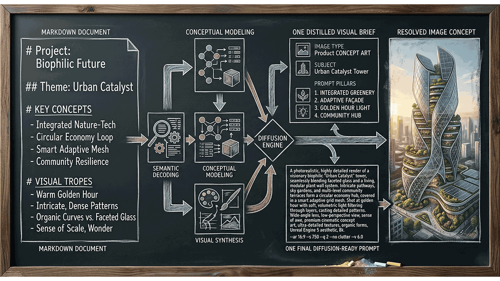

# Markdown Illustrator



This skill reads a markdown file and answers directly in chat with one visualization-focused Visual Brief plus one final prompt compiled to be concrete, readable, and diffusion-ready.

## Critical

- Keep the workflow narrow by default: one document-wide visual interpretation, one shared summary, one final prompt, direct chat response.
- Use the Visual Brief as the anchor for the final prompt.
- Default to best-effort reasoning across diffusers. Only become narrower or model-specific when the user explicitly asks.
- Treat final prompt generation like prompt compilation: preserve intent, but strengthen clarity, structure, physical grounding, and renderability.
- Do not turn visual strategy into a questionnaire. Infer a small set of visual defaults and proceed unless the user explicitly asks to steer them.
- Default to de-duplicated composition. Show each major concept, phase, label, callout, panel, or document fragment once unless the user explicitly asks for repetition, comparison, or multi-panel variation.

## Output Contract

Return this structure directly in chat:

```markdown
## Visual Brief

**Subject:** [one-sentence description of what the document is truly about]
**Audience:** [who the document is for]
**Core narrative:** [the tension, movement, or transformation inside the document]
**Visual opportunity:** [the most compelling scene, metaphor, or spatial idea to visualize]
**Mood:** [the emotional tone the image should carry]
**Must-show elements:** [3-6 concrete visual anchors that belong in the image]
**Avoid:** [things that would misrepresent or weaken the image]

## Final Prompt

[one production-ready prompt paragraph]
```

The Visual Brief is the anchor. The final prompt is the best single visual interpretation of that shared meaning.

## Workflow

1. Read the markdown file for meaning, not for headings.
2. Distill the whole document into a Visual Brief optimized for visualization.
3. Infer a compact visual strategy from the request and document without asking follow-up questions.
4. Generate one best-effort final prompt from that summary and strategy.
5. Return the result directly in chat.
6. If the user explicitly asked for constraints such as `Flux`, `photorealistic`, `editorial illustration`, `16:9`, `avoid people`, `whiteboard`, or `blackboard`, honor them inside the final prompt without turning the interaction into a selection flow.

## Reading the Markdown

Extract:

- the real subject of the document
- the intended audience
- the central transformation, conflict, or promise
- recurring symbols, systems, environments, or objects
- the emotional energy the image should carry

Do not mirror every section. Distill the document into one image-worthy idea.

Ignore headings that are structural only, such as `Table of Contents`, `References`, or appendices, unless the user explicitly wants them reflected.

## Writing the Visual Brief

Write the summary for visualization, not for literary analysis.

- **Subject** should identify what the image is fundamentally about.
- **Audience** should clarify how polished, technical, aspirational, or educational the image should feel.
- **Core narrative** should name the movement or tension, such as migration, orchestration, discovery, simplification, growth, launch, or coordination.
- **Visual opportunity** should identify the strongest scene or metaphor, not a style label.
- **Mood** should guide lighting, composition energy, and texture.
- **Must-show elements** should name only the elements that materially improve recognition and fidelity.
- **Avoid** should protect against misleading clichés, irrelevant detail, or flat literalism.

## Inferring Visual Strategy

Infer these dimensions silently. Do not present them as a menu.

- **Intent**: choose `hero`, `digest`, `diagram`, or `cover`.
  - Use `hero` for requests such as `hero image`, `breathtaking`, `cinematic`, `launch`, `raise interest`, or when no stronger signal exists.
  - Use `digest` for requests such as `digest`, `overview`, `summary`, `onboarding`, or `explain`.
  - Use `diagram` for requests such as `diagram`, `systems`, `process`, `architecture`, `workflow`, or `pipeline`.
  - Use `cover` for requests such as `cover image`, `keynote opener`, `poster`, or `editorial cover`.
- **Visual treatment**: preserve explicit user styles such as `whiteboard`, `blackboard`, `scientific`, `hand-drawn`, `isometric`, or `minimal line art`. If the user gives no style signal, default to `cinematic editorial`.
- **Abstraction level**: choose `literal`, `balanced`, or `concept-led`.
  - Use `concept-led` for `wow`, `hero`, `cinematic`, `breathtaking`, `desirable`, or `raise interest`.
  - Use `balanced` for `digest`, `overview`, `onboarding`, `educational`, or `systems`.
  - Use `literal` only when the user explicitly asks for faithful, exact, or direct process depiction.
  - Default to `concept-led` for `hero` and `cover`, and `balanced` for `digest` and `diagram`.
- **Label density**: choose `none`, `minimal`, `light`, or `academic`.
  - Use `none` or `minimal` for `hero`, `cinematic`, `minimal text`, or `infographic-first`.
  - Use `academic` for `scientific`, `textbook`, `educational diagram`, or explicit labeling requests.
  - Otherwise default to `minimal`.
- **Aspect ratio**: prefer wide compositions.
  - Honor an explicit user ratio such as `16:9`, `3:2`, `4:3`, or `1:1`.
  - Otherwise default to `16:9` for hero, cover, cinematic, keynote, and most digest requests.
  - Use `3:2` when the composition feels more editorial, poster-like, or object-centered and slightly less panoramic framing improves clarity.
  - Avoid defaulting to `1:1` unless the user explicitly asks for it.

Keep the output contract unchanged: always return both `Visual Brief` and `Final Prompt` unless the user explicitly asks for prompt-only output.

## Compiling the Final Prompt

Write one vivid prompt paragraph that another agent or human can paste into a diffuser.

Default behavior:

- Optimize for broad diffuser compatibility.
- Prefer natural language over vendor-specific syntax.
- Convert abstract ideas into concrete visual elements. Represent concepts as visible objects, scenes, marks, layers, flows, or diagram components.
- Be specific about the scene, relationships, and visual anchors when that specificity strengthens the image.
- Favor one memorable visual concept over a crowded checklist.
- Use best-effort reasoning to choose the strongest visual treatment for the document.

Compiler rules:

- Enforce strong composition. Prefer clear spatial structure such as `on the left`, `in the center`, and `on the right` when useful.
- Show transformation explicitly. If the document is about change, process, or reasoning, visualize it through arrows, flows, transitions, intermediate stages, or layered progression.
- Use the inferred strategy to bias the image strongly instead of asking for clarification.
  - `hero` and `cover`: prioritize spectacle, memorability, atmosphere, premium composition, and one dominant visual idea over procedural completeness.
  - `digest`: prioritize readability, overview, and a satisfying big-picture synthesis without turning the image into a wall of cards.
  - `diagram`: prioritize system legibility, visual flow, and structural clarity without becoming text-heavy.
  - `concept-led`: prefer one striking scene or metaphor that captures the document's meaning, even if not every process step is shown literally.
  - `balanced` or `literal`: keep more visible process fidelity, but still avoid sterile box-and-arrow overload.
- Prefer one authoritative artifact over repeated fragments. If the image resembles a document, diagram, scientific plate, dashboard, or infographic, bias strongly toward one clean instance of each structural element rather than many similar panels or echoed blocks.
- Add cognitive structure when relevant, but use embedded text sparingly. Prefer arrows, icons, blocks, and symbolic grouping over text-heavy diagrams because image models often render words poorly.
- If labels or annotations are truly necessary, keep them very short, secondary, and non-critical to success. Prefer one-to-three-word phrases over readable sentences or dense copy.
- Ground the image in a physical medium when appropriate. If the chosen treatment benefits from a medium such as whiteboard, chalkboard, blueprint, or another concrete surface, describe material details like marker strokes, chalk dust, lighting, texture, and small imperfections.
- Steer the composition toward a wide frame by default. Prefer `16:9` unless `3:2` clearly better supports the scene; avoid implying `1:1` unless the user explicitly asked for square output.
- Control complexity aggressively. Keep one dominant idea, one obvious focal path, and one readable hierarchy.
- Add negative constraints directly into the prompt to prevent failure modes, using phrases like `no clutter`, `no chaos`, `no unnecessary elements`, `clean composition`, and `intentional layout` where appropriate.
- Add anti-repetition constraints by default, especially for structured visuals. Use phrases such as `no duplicated sections`, `no repeated bullets`, `no repeated steps`, `no echoed callouts`, `no mirrored panels`, `one authoritative page or diagram`, and `one instance per concept` unless the user explicitly asked for repetition.
- When text rendering is a risk, add a direct steer such as `no gibberish text`, `no fake words`, `no dense paragraphs`, or `minimal legible labels only if essential`.
- Describe what is seen, not what is implied. Replace conceptual wording with observable visual detail.
- Preserve the user's meaning. Improve execution, not intent.

Output rule:

- Output a single refined prompt only under `## Final Prompt`, with no extra explanation inside that section.
