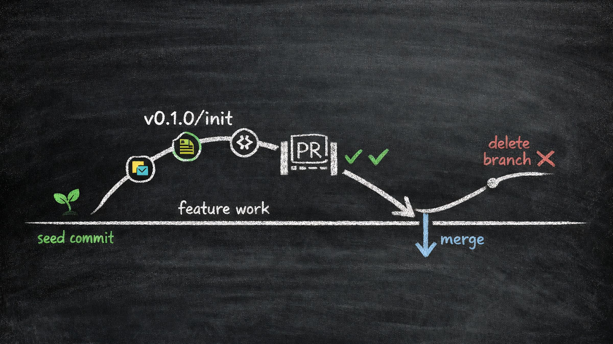

# Trunk-First Repo



Initialize a folder as a git repository following [scaled trunk-based development](https://trunkbaseddevelopment.com/#scaled-trunk-based-development). The core principle: **main is sacred** — it starts empty and content only enters through peer-reviewed pull requests from short-lived feature branches.

This matters because it prevents accidental pushes to main, establishes a clean PR-based workflow from day one, and makes the git history meaningful by design rather than as an afterthought.

## Workflow

### Step 0: Select Mode

If the user says `push remote`, do not initialize the repository again. Use the Push Remote Workflow below.

Otherwise, use the Initialize Workflow.

## Initialize Workflow

### Step 1: Collect Parameters

Read `FORMS.md` and collect all parameters by presenting each field to the user one at a time using the agent's native input mechanism. Follow the presentation rules defined in the form. Do not proceed to Step 2 until all required fields are collected and the user confirms the summary.

### Step 2: Initialize the Repository

Run these commands in order. Each step is intentional — don't skip or reorder:

```bash
# 1. Initialize git in the current directory
git init

# 2. Create an orphan main branch (no parent commit, completely empty)
git checkout --orphan main

# 3. Make sure nothing is staged (the orphan checkout may auto-stage files)
git rm -rf --cached . 2>/dev/null || true

# 4. Seed main with an empty commit — this is the only direct commit to main, ever
git commit --allow-empty -m "🌱 seed empty main branch"

# 5. Create and switch to the feature branch
git checkout -b {VERSION_PREFIX}/{BRANCH_CONTEXT}
```

After step 5, the user is on the feature branch (e.g. `v0.1.0/init`) with all their project files unstaged and ready for their first real commit.

### Step 3: Set Remote Origin (optional)

If the user provided a remote URL:

```bash
git remote add origin {REMOTE_URL}
git push -u origin main:main
```

Run the push while still on the feature branch. Do not switch to `main` just to push it; Git can push the branch ref by name without changing the working tree.

If skipped, remind the user they can add it later:

> When you're ready, invoke this skill with `push remote <url>` from the feature branch, or run `git remote add origin <url>` followed by `git push -u origin main:main`

### Step 3a: First Feature Push

After the user commits the first project files on the feature branch:

If Step 3 already configured and pushed `origin/main`, publish only the current feature branch:

```bash
git push -u origin HEAD
```

If the remote was not configured during initialization, do not inline a shortened variant here. Use the Push Remote Workflow below instead so it:

- checks `git branch --show-current` before pushing
- verifies `main` is still only the empty seed branch with `git ls-tree -r --name-only main`
- adds `origin` only when needed
- pushes `main:main` before `HEAD`

This avoids a redundant `git push -u origin main:main` when Step 3 already handled the empty trunk push, while keeping the guarded `main`-before-`HEAD` order for late-remote cases.

Do not manually delete project files from the working tree to "clean" `main`. When the user is worried about files appearing on `main`, explicitly explain that untracked or ignored checkout files can remain visible in the directory but are not part of the `main` branch. If the user needs to verify that `main` is empty, inspect the branch tree instead of the checkout directory:

```bash
git ls-tree -r --name-only main
```

An empty output means `main` contains only the seed commit. Untracked or ignored files in the checkout directory are not part of `main`.

If the feature branch was accidentally pushed before `main`, push `main` next and change the remote repository's default branch to `main` before opening the PR.

### Step 4: Summary

After initialization, display the matching summary:

If Step 3 configured `origin`:

```
✅ Repository initialized with trunk-first workflow

  main branch:    🌱 seeded (empty — content enters only via PRs)
  feature branch: v0.1.0/init (current — start working here)
  remote:         origin -> https://github.com/example/repo.git

  Next steps:
  1. Stage and commit your files on this branch
  2. When the branch is ready, push it with `git push -u origin HEAD`
  3. Open a PR to main
  4. After review, merge the PR — main stays clean
```

If Step 3 was skipped:

```
✅ Repository initialized with trunk-first workflow

  main branch:    🌱 seeded (empty — content enters only via PRs)
  feature branch: v0.1.0/init (current — start working here)
  remote:         not configured (add later with `git remote add origin <url>`)

  Next steps:
  1. Stage and commit your files on this branch
  2. When the remote is ready, invoke `push remote <url>` from this branch
  3. Push main first with `git push -u origin main:main`
  4. Push the feature branch with `git push -u origin HEAD` and open a PR to main
  5. After review, merge the PR — main stays clean
```

## Push Remote Workflow

Use this workflow when the user invokes `push remote`, especially when the remote URL was not available during initialization.

### Step P1: Confirm Current State

Inspect the current branch:

```bash
git branch --show-current
```

If the current branch is `main`, stop and ask the user to switch to the feature branch first. Do not push the first feature branch while checked out on `main`.

Verify `main` is still the empty seed branch:

```bash
git ls-tree -r --name-only main
```

Empty output is expected. If output is not empty, stop and explain that `main` already contains files, so this is no longer the empty trunk-first seed state.

When explaining this check, explicitly say that untracked or ignored files can remain visible in the checkout directory but are not part of `main` unless they appear in `git ls-tree -r --name-only main`.

### Step P2: Resolve Remote

Check whether `origin` already exists:

```bash
git remote get-url origin
```

If `origin` exists, use it.

If `origin` does not exist and the user provided a URL after `push remote`, add it:

```bash
git remote add origin {REMOTE_URL}
```

If `origin` does not exist and the user did not provide a URL, ask for the remote URL before proceeding. Do not guess or use a placeholder.

### Step P3: Push in Safe Order

Run these commands from the feature branch:

```bash
git push -u origin main:main
git push -u origin HEAD
```

Do not switch to `main` just to push it. Git can push the `main` branch ref by name while the checkout stays on the feature branch.

After pushing, tell the user to open a PR from the pushed feature branch to `main`.

## Conventions

### Branch Naming

Feature branches follow the pattern `v{MAJOR.MINOR.PATCH}/{context}`:

```
v0.1.0/init              ← MVP, initial setup
v0.0.1/spike-auth        ← PoC, exploring authentication
v1.0.0/release-prep      ← Production, preparing first release
v0.1.0/add-user-api      ← MVP, adding user API endpoints
```

The version prefix groups branches by project maturity. The context should be short, lowercase, and hyphen-separated — descriptive enough to understand at a glance.

### The Golden Rule

**Never commit directly to main.** After the seed commit, all changes reach main exclusively through pull requests. This ensures:

- Every change is peer-reviewed before merging
- Main is always in a known-good state
- The PR history tells the story of how the project evolved
- CI/CD pipelines validate changes before they land

### Working with This Workflow

Once initialized, the day-to-day workflow is:

1. **Create a feature branch** from main: `git checkout -b v0.1.0/my-feature main`
2. **Work and commit** on the feature branch
3. **Push main by ref if the remote does not have it yet**: `git push -u origin main:main`
4. **Push the feature branch and open a PR** to main: `git push -u origin HEAD`
5. **Review, approve, and merge** the PR
6. **Delete the feature branch** after merge
7. **Pull main** and create the next feature branch

Feature branches should be short-lived — ideally merged within hours or a few days, not weeks.
